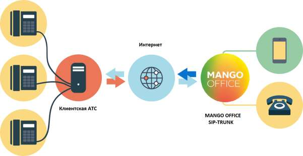

# 5.2. Что такое SIP Trunk

> Трассировка: PDF §5.2 · сквозные стр. 520-521 · источники: ч.1 `kb/sources/mango-lk-manual/LK_manual_v-123.pdf` с.520-521.

5.1 ТЕРМИНЫ И ОПРЕДЕЛЕНИЯ DID-номера - телефонные номера, которые предоставляет Mango Office. ТФОП - телефонная сеть общего пользования. кАТС - клиентская АТС. ВАТС - Виртуальная АТС MANGO OFFICE 5.2 ЧТО ТАКОЕ SIP TRUNK SIP Trunk – это виртуальный канал связи между вашей АТС (кАТС) и Виртуальной АТС MANGO OFFICE. Он позволяет объединить различные АТС в единую сеть и совершать внутренние, входящие и исходящие звонки независимо от того, к какой именно АТС принадлежит тот или иной сотрудник или телефонный номер.

