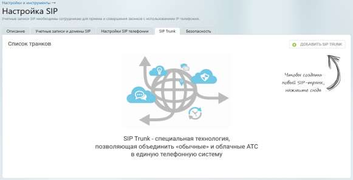

# 5.3. Создание и редактирование SIP Trunk

> Трассировка: PDF §5.3 · сквозные стр. 521-522 · источники: ч.1 `kb/sources/mango-lk-manual/LK_manual_v-123.pdf` с.521-522.

5.3 СОЗДАНИЕ И РЕДАКТИРОВАНИЕ SIP TRUNK В подразделе “Настройки SIP” раздела “Настройки и инструменты” Личного кабинета пользователя ВАТС выберите вкладку SIP Trunk и нажмите кнопку Добавить SIP TRUNK. Далее выберите вид создаваемого транка: внешний или внутренний. • Внешний – обеспечивает связь между вашей АТС (кАТС) и Виртуальной АТС MANGO OFFICE. • Внутренний – обеспечивает связь между разными Виртуальной АТС MANGO OFFICE.

