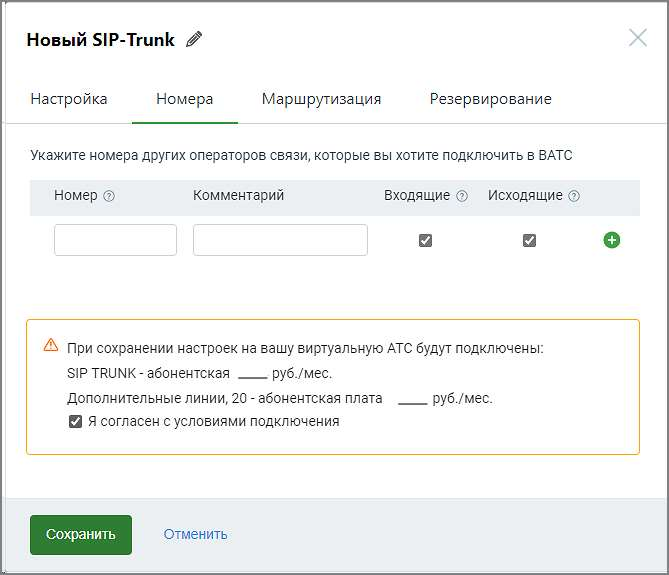

# 5.3.1.2. Номера

> Трассировка: PDF §5.3.1.2 · сквозные стр. 525-527 · источники: ч.1 `kb/sources/mango-lk-manual/LK_manual_v-123.pdf` с.525-527.

Заполните поля: Номер - если к вашей АТС подключены номера какого-то оператора связи, и вы хотите сделать их доступными через сип-транк, их необходимо указать здесь. Формат ввода номера - E.164 без пробелов, например 74951234567. Комментарий - информация произвольного характера, не более 50 символов. Поле не обязательно для заполнения; Укажите желаемые направление вызовов. В зависимости от выбора направления через SIP Trunk пользователь cможет: ● Входящие - номер будет отображен в списке номеров других операторов связи в разделе “Номера, подключенные к АТС”. Это позволит настроить для него голосовое меню IVR и правила переадресации (распределения) звонков.

● Исходящие - номер будет отображен в списке доступных для выбора исходящих линий в карточках сотрудников ВАТС. При выборе его в качестве исходящий линии и совершении сотрудником исходящего звонка, он будет направлен в сип- транк. Если номер используется (например, в схеме переадресации), при редактировании транка отключить чекбокс «звонить» невозможно.

Чтобы удалить введенный номер, кликните по пиктограмме в строке выбранного номера. Если для данного номера настроены схемы распределения вызовов, переадресация или он используется в качестве исходящего номера абонента, номер не может быть удален.

