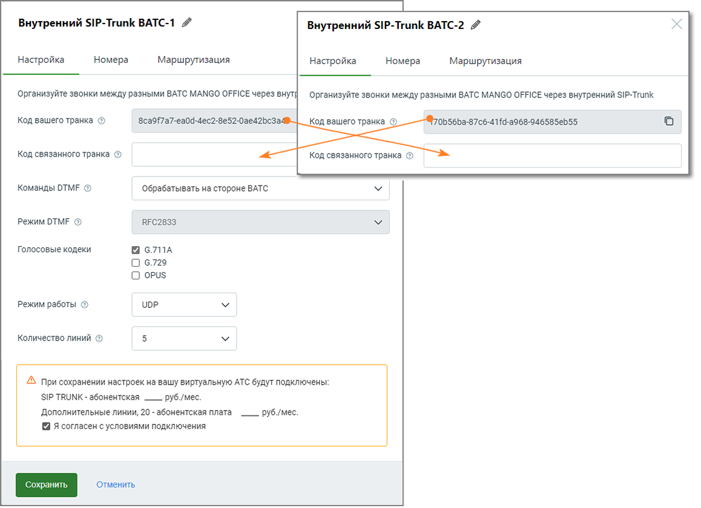

# 5.3.2.1. Настройка

> Трассировка: PDF §5.3.2.1 · сквозные стр. 534-536 · источники: ч.5 `kb/sources/mango-lk-manual/LK_manual_v-121часть-5.pdf` с.130-132.

Для настройки внутреннего SIP Trunk необходимо установить связь между двумя ВАТС, прописав соответствующие параметры, которые позволят им взаимодействовать между

собой. Это обеспечит внутренние коммуникации между филиалами или частями одной и той же компании через SIP Trunk.

При заполнении остальных полей формы, руководствуйтесь инструкциями, предоставленными в разделе Настройка для внешнего SIP Trunk.

