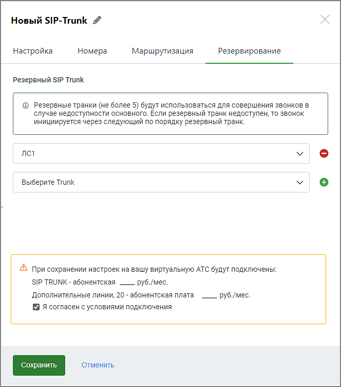

# 5.3.1.4. Резервирование

> Трассировка: PDF §5.3.1.4 · сквозные стр. 530-531 · источники: ч.1 `kb/sources/mango-lk-manual/LK_manual_v-123.pdf` с.530-531.

На вкладке Резервирование следует задать список резервных SIP Trunk (максимальное количество – 5), которые будут использоваться для совершения звонков в случае недоступности основного. Если резервный транк недоступен, то звонок инициируется через следующий по списку резервный транк.

