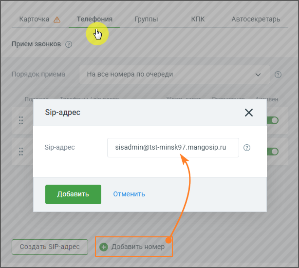

# 5.3.3. Активация SIP Trunk в карточке сотрудника

> Трассировка: PDF §5.3.3 · сквозные стр. 538-539 · источники: ч.5 `kb/sources/mango-lk-manual/LK_manual_v-121часть-5.pdf` с.134-135.

Чтобы установить SIP Trunk для исходящих вызовов конкретного сотрудника, откройте Карточку сотрудника в разделе Сотрудники Личного кабинета MANGO OFFICE. Перейдите во вкладку Телефония.

Кликните по кнопке Добавить номер и добавьте сотруднику номер SIP Trunk. Сохраните внесенные изменения кнопкой Сохранить. Примеры: ПРИМЕР 1. Сотрудник ВАТС, у которого в качестве исходящего номера указан номер транка, набирает номер 456, который не является внутренним номером другого

сотрудника данной ВАТС, при этом во вкладке «Маршрутизация» настроен транк с префиксом "45". Результат: звонок инициируется через определенный транк с префиксом "45". ПРИМЕР 2. Сотрудник ВАТС, у которого в качестве исходящего номера указан номер транка, набирает номер 789, который не является внутренним номером другого сотрудника данной ВАТС, при этом нет настроенных транков с префиксом "78". Результат: звонок инициируется через транк, выбранный в качестве исходящего номера сотрудника. ПРИМЕР 3. Сотрудник ВАТС, у которого в качестве исходящего номера указан номер транка, набирает номер 123, который является внутренним номером другого сотрудника данной ВАТС. Результат: звонок будет направлен сотруднику ВАТС с номером 123.
