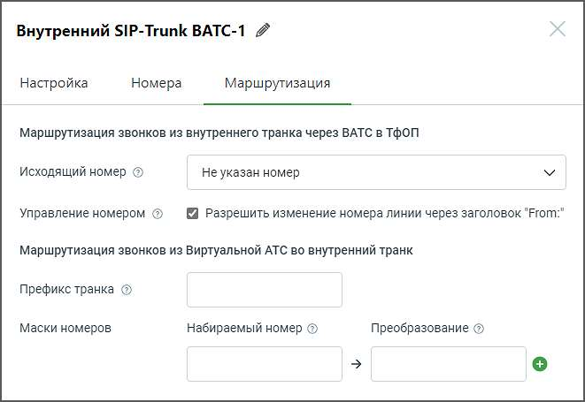

# 5.3.2.3. Маршрутизация

> Трассировка: PDF §5.3.2.3 · сквозные стр. 534-535 · источники: ч.1 `kb/sources/mango-lk-manual/LK_manual_v-123.pdf` с.534-535.

При заполнении полей формы, руководствуйтесь инструкциями, предоставленными в разделе Маршрутизация для внешнего SIP Trunk.

