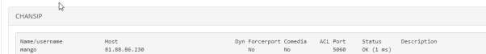

# 5.7.1.1. Как проверить состояние транка

> Трассировка: PDF §5.7.1.1 · сквозные стр. 556 · источники: ч.1 `kb/sources/mango-lk-manual/LK_manual_v-123.pdf` с.556.

Проверить состояние транка можно через меню Reports-Asterisk Info:

