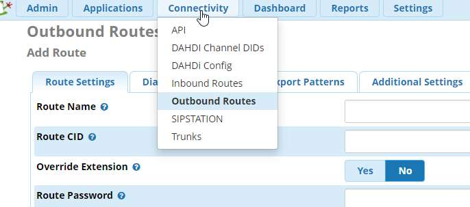
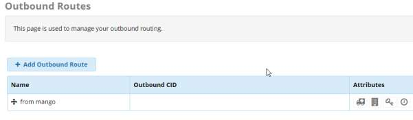
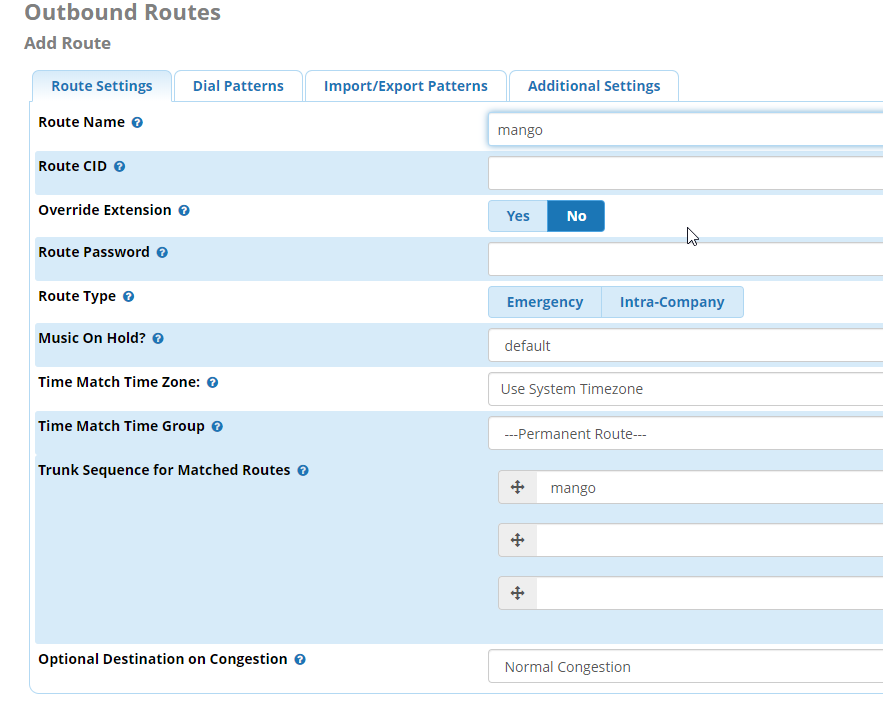
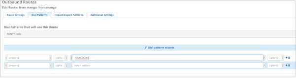

# 5.7.1.2. Исходящая маршрутизация

> Трассировка: PDF §5.7.1.2 · сквозные стр. 556-559 · источники: ч.1 `kb/sources/mango-lk-manual/LK_manual_v-123.pdf` с.556-559.

Outbound Routes - исходящая маршрутизация FreePBX. На основании набранного номера выбирается направление (транк) для исходящего вызова. Набираемый номер делится на префикс и паттерн и может модифицироваться после набора. Connectivity > Outbound Routes (Подключения > Исходящая Маршрутизация)

Route name – имя маршрута Trunk Sequence for Matched Routes – выбор транка для данного маршрута Вкладка Dial Pattern Шаблон набора номера (Dial Pattern) – это уникальный набор цифр, который позволяет отправить вызов в нужный SIP–транк. Если шаблон совпадает, то вызов отправляется через SIP–транк в сторону провайдера. Шаблон набора номера имеет 4 поля настройки: Prepend, Prefix, Match Pattern и CallerID. Формат шаблона: (prepend) prefix | [ match pattern / caller ID ], где

● X - любое целое число от 0 до 9 ● Z - любое целое число от 1 до 9 ● N - любое целое число от 2 до 9 ● [#####] - любое целое число в скобках. Например, перечисление – [1.2.7], или диапазон чисел –[1.2.6-9], в который попадают числа 1,2,6,7,8,9 ● .(точка) -любой набор символов

<!-- изображение на стр. 559: байты не извлечены (PyMuPDF недоступен) -->

Поля, доступные для заполнения: Prepend - данная часть будет добавлена к номеру, перед отправкой в SIP – транк в случае совпадения шаблона. Prefix - префикс – это часть шаблона, которая будет удалена Match Pattern - Набранный номер. ВАЖНО: Asterisk ищет совпадения сопоставляя поле Prefix и Match Pattern. CallerID - данный звонок будет выполнен только в случае, если звонок инициирован с указанного CallerID. В данном поле можно использовать шаблоны. Полезно, если компания имеет несколько офисов с нумерацией виду 1XXX, 2XXX и так далее. Указанный на скриншоте шаблон 795ХХХХХХХ соответствует номерам из 10 цифр начинающимся на 795.
