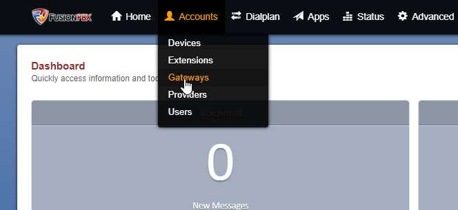

# 5.7.2. Создание SIP trunk для FusionPBX (Freeswitch)

> Трассировка: PDF §5.7.2 · сквозные стр. 559-562 · источники: ч.1 `kb/sources/mango-lk-manual/LK_manual_v-123.pdf` с.559-562.

Откройте меню администрирования транков во вкладке Gateways раздела Accounts.

Для добавления нового транка нажмите пиктограмму “+”.

В открывшейся форме необходимо заполнить поля: Gateway – имя транка. В примере используем имя mango. Username, Password- обязательные поля заполняются любыми значениями Proxy- SIP сервер провайдера Register – выставляем false Context - по умолчанию Public Profile - по умолчанию External Enabled - True

Сохраните введенные данные кнопкой Save.

