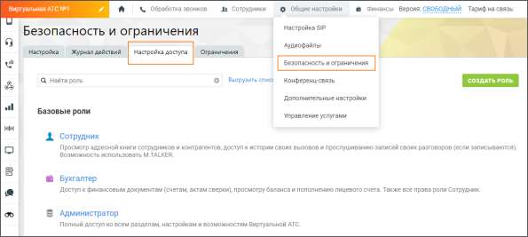

# 6. Роли и права доступа ЛК ВАТС

> Трассировка: PDF §6 · сквозные стр. 565 · источники: ч.1 `kb/sources/mango-lk-manual/LK_manual_v-123.pdf` с.565.

Пользователь ВАТС может настроить права доступа для сотрудников в зависимости от их ролей. Для настройки следует последовательно пройти в разделы Общие настройки → Безопасность и ограничения → Настройка доступа. На продукте преднастроены: • базовые роли - Сотрудник, Бухгалтер, Администратор, Руководитель группы. • дополнительные роли – Старший сотрудник, Маркетолог, Руководитель компании. Пользовательские роли можно добавить самостоятельно, нажав на кнопку «Создать роль». Клик по наименованию роли открывает ее для изменения прав доступа.

По ссылке приведено сводное описание параметров доступности, разрешений (прав) и функциональных возможностей Личного кабинета ВАТС MANGO OFFICE в зависимости от выбранной преднастроенной роли Роли и права доступа ВАТС MANGO OFFICE.
