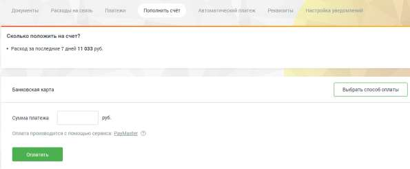
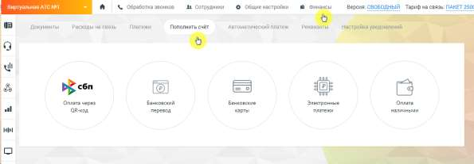

# 2.5. Пополнить счет

> Трассировка: PDF §2.5 · сквозные стр. 34 · источники: ч.1 `kb/sources/mango-lk-manual/LK_manual_v-123.pdf` с.34.

2.5 ПОПОЛНИТЬ СЧЕТ На вкладке Пополнить счет расположена форма для быстрого зачисления средств через платежную систему PayMaster. Укажите сумму платежа, нажмите кнопку Оплатить и действуйте согласно инструкции в открывшейся форме PayMaster.

Также пополнять счет можно иными способами. Выберите наиболее удобный для вас.

Для того, чтобы вам было легче ориентироваться в своих расходах, на каждой странице с выбранным способом оплаты размещен информационный блок "Сколько положить на счет?". Он содержит информацию о расходах за последние 7 и 30 календарных дней соответственно. Для новых клиентов блок "Сколько положить на счет" отображается только на 9-ый день использования продукта. Начиная с 32-го дня выводятся две строки о расходах.
