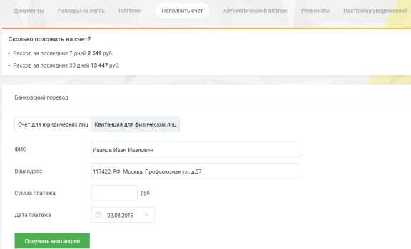

# 2.5.1.2. Физическим лицам

> Трассировка: PDF §2.5.1.2 · сквозные стр. 35-36 · источники: ч.1 `kb/sources/mango-lk-manual/LK_manual_v-123.pdf` с.35-36.

Перейдите на вкладку «Квитанция для физических лиц». Укажите ФИО, адрес, сумму платежа в соответствующих полях. Введите дату платежа, нажав значок календаря, или в формате дд.мм.гггг.

Нажмите кнопку Получить квитанцию. В зависимости от настроек браузера на новой странице или вкладке откроется готовая к печати квитанция. Проверьте правильность внесенных данных. Нажмите «Распечатать» (при необходимости используйте полосу прокрутки). Откроется стандартное диалоговое окно, позволяющее выбрать параметры печати.
