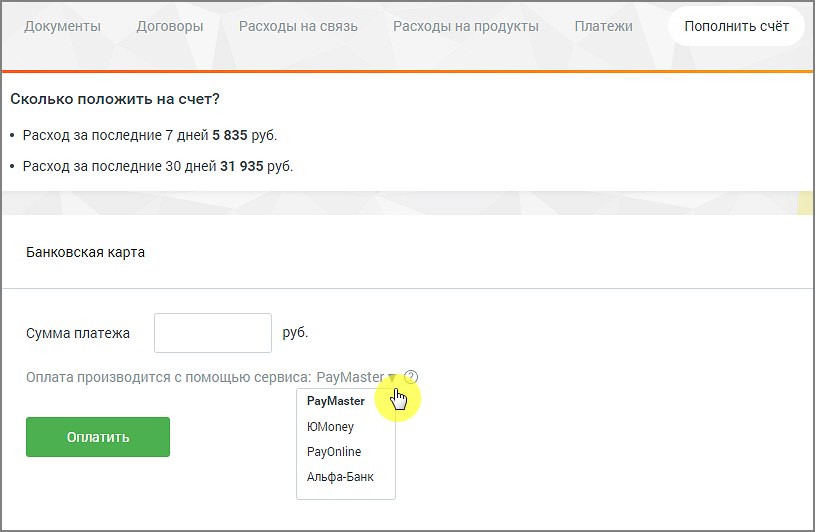

# 2.5.2. Банковские карты

> Трассировка: PDF §2.5.2 · сквозные стр. 36-37 · источники: ч.1 `kb/sources/mango-lk-manual/LK_manual_v-121часть-1.pdf` с.36-37.

Пополнение счета с помощью банковских карт возможно через системы: • Paymaster; • PayOnline; • ЮMoney; • Альфа-Банк.

Введите цифрами сумму платежа в одноименное поле. Выберите сервис, при помощи которого будет произведена оплата. Нажмите Оплатить. В результате будет открыта новая вкладка браузера на странице выбранного сервиса.
