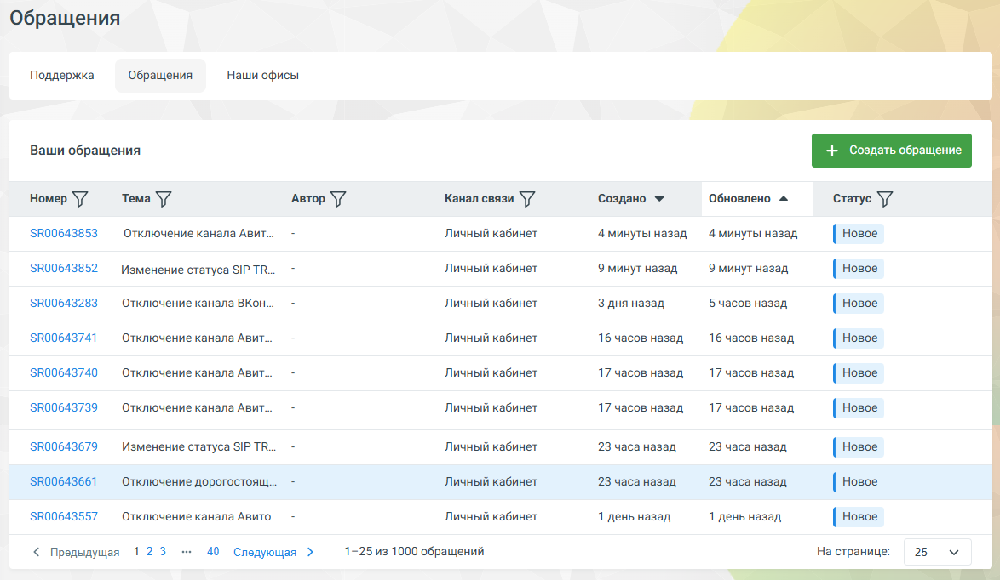

# 3.2. Вкладка «Обращения»

> Трассировка: PDF §3.2 · сквозные стр. 52 · источники: ч.1 `kb/sources/mango-lk-manual/LK_manual_v-121часть-1.pdf` с.52.

• Ссылка Вся документация — открывает раздел «Поддержки» на сайте MANGO OFFICE https://www.mango-office.ru/support/ • Интеграция с MangoHelper • Ссылки на программы удалённой поддержки (AnyDesk, TeamViewer) 3.2 ВКЛАДКА «ОБРАЩЕНИЯ»

