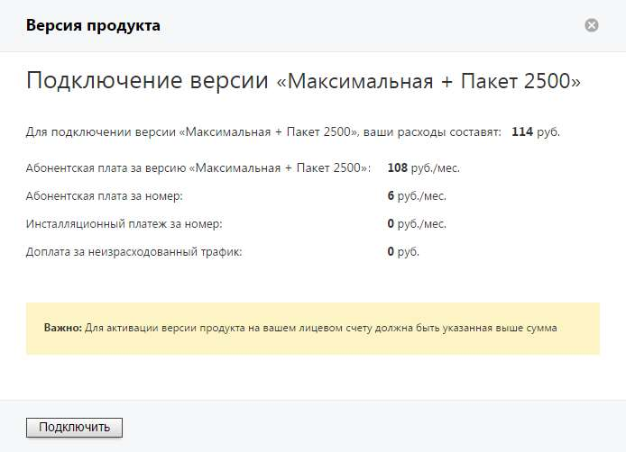
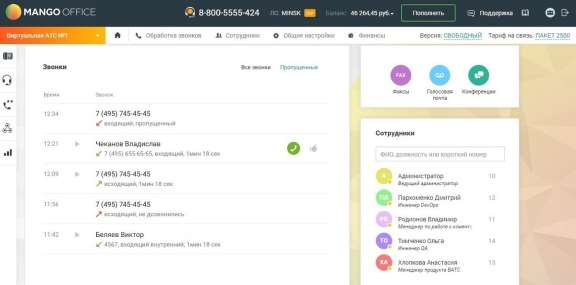

# Главная страница пользователя

> Трассировка: PDF §4 · сквозные стр. 58-59 · источники: ч.1 `kb/sources/mango-lk-manual/LK_manual_v-123.pdf` с.58-59.

Внимание Если на вашем лицевом счету указанная сумма отсутствует, то кнопка Подключить будет неактивна. Если при подключении пользователь указал дату плановой активации, она отображается на главной странице Личного кабинета. Как правило, эта опция применяется при необходимости отсроченной активации ВАТС. ГЛАВНАЯ СТРАНИЦА ПОЛЬЗОВАТЕЛЯ Главная страница пользователя представляет собой персональную рабочую среду пользователя в Личном кабинете. Доступный пользователю функционал настраивается ответственным сотрудником на вкладке «Настройка доступа» раздела «Безопасность и ограничения». Вид рабочего стола приведен на изображении ниже.

Шапка рабочего стола аналогична стандартной шапке Личного кабинета. Описание панелей приведено в разделе «Раздел 1. Добро пожаловать в Личный кабинет!». Основная область рабочего стола содержит виджеты:
