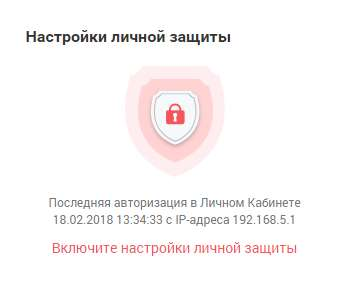
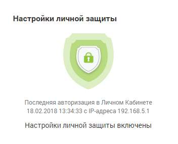
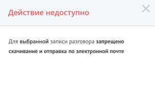

# Виджет «Настройки личной защиты»

> Трассировка: PDF §4 · сквозные стр. 63-64 · источники: ч.1 `kb/sources/mango-lk-manual/LK_manual_v-123.pdf` с.63-64.

Виджет доступен только для пользователей с ролью «Руководитель компании», а также ролей, созданных на её основе. Виджет позволяет ограничить доступ остальных пользователей к прослушиванию, скачиванию и отправке записей разговоров руководителя, паролю его SIP-учетной записи и т.д. При выключенных настройках личной защиты виджет отображается в виде:

Для включения настроек следует щелкнуть по кнопке и выбрать необходимые настройки. Для получения дополнительных сведений следует навести курсор на

пиктограмму напротив наименования настройки: • Запретить прослушивать записи моих разговоров: o Запрет на прослушивание записей разговоров; o Запрет на скачивание записей разговоров; o Запрет на отправку записей разговоров на E-mail через интерфейс ЛК; • Запретить автоматическую отправку записей разговоров по API во внешние системы; • Запретить просматривать и изменять пароль от учетной записи: o Запрет на просмотр и изменение паролей от SIP-учетных записей, а также пароля для входа в Личный кабинет и Контакт-центр; • Запретить изменять роль. Для сохранения изменений следует нажать на кнопку Применить. При выборе хотя бы одной настройки вид виджета меняется на следующий:

В общем списке записей разговоров для пользователей с ролью, отличной от роли

«Руководитель компании», защищенные записи отмечаются иконкой и недоступны для прослушивания, скачивания и отправки. При попытке скачивания либо отправке на экране будет отображено соответствующее сообщение:

