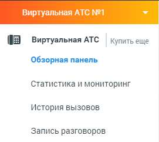

# Начало работы

> Трассировка: PDF §4 · сквозные стр. 70 · источники: ч.1 `kb/sources/mango-lk-manual/LK_manual_v-123.pdf` с.70.

НАЧАЛО РАБОТЫ При первом запуске Виртуальной АТС в левом вертикальном меню откройте подраздел Обзорная панель раздела Виртуальная АТС.

Там вы сможете настроить следующие этапы: • Создание сотрудников • Создание групп и объединение сотрудников в группы • Настройка приема звонков • Подключение телефона После завершения основных настроек ВАТС готова к работе.
