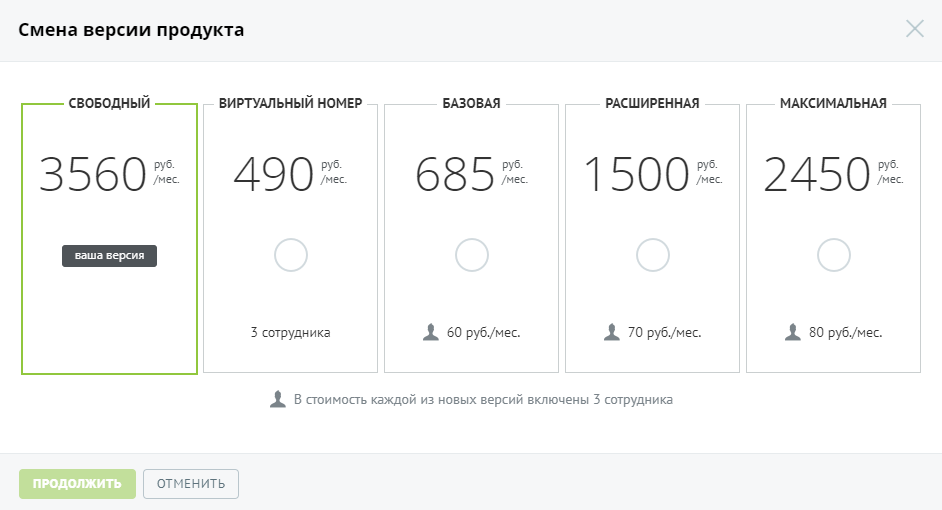
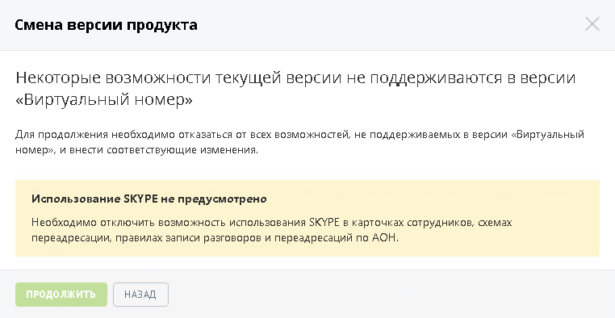
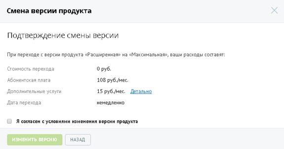
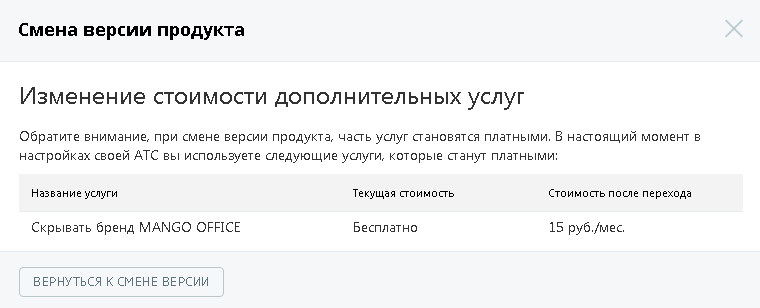
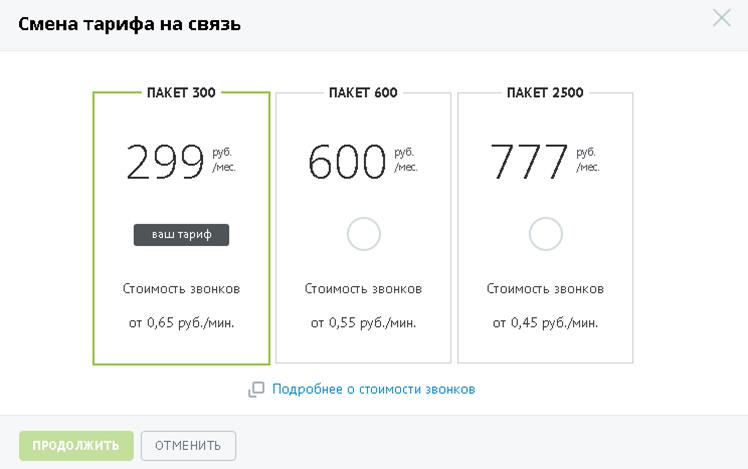
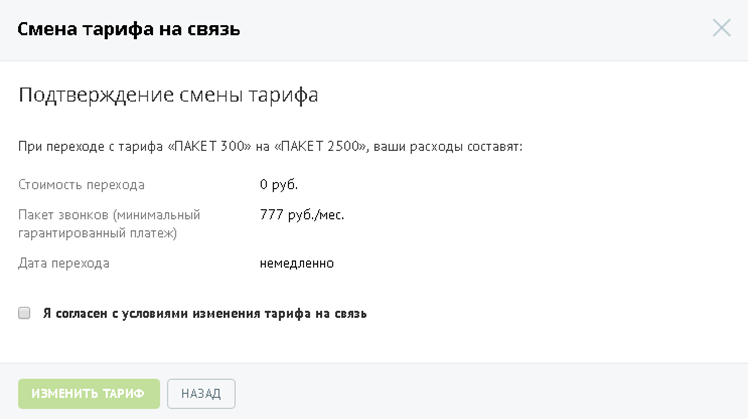

# 4.1.1. Смена версии и тарифа продукта

> Трассировка: PDF §4.1.1 · сквозные стр. 71-75 · источники: ч.1 `kb/sources/mango-lk-manual/LK_manual_v-121часть-1.pdf` с.71-75.

Вы можете изменить версию и тариф продукта на другие, согласно вашим потребностям и расходам. Для этого нажмите на название версии и тарифа соответственно. Ссылки доступны пользователям с ролью Администратор Лицевого счета или Администратор ВАТС. Смена версии Название версии продукта, которую вы используете на данный момент, выделено другим цветом с надписью «ваша версия». Выберите новую версию продукта, щелкнув по соответствующему прямоугольнику:

совет Для некоторых версий Виртуальной АТС недоступно самостоятельное изменение версии. Для внесения изменений необходимо обратиться к вашему менеджеру по тел. 8-800-555-55-22. При переходе на более упрощенную версию ВАТС относительно текущей (т.н. понижение версии) на форме с условиями перехода отображается дополнительное предупреждение.

Для продолжения выберите другую версию продукта или отключите указанные услуги. Если новая версия продукта поддерживает все возможности текущей, то на экране отображается форма с условиями перехода на новую версию:

внимание Обратите внимание, что при смене версии продукта сервисы, подключенные вами ранее, могут изменить стоимость. Для детального ознакомления со стоимостью подключенных дополнительных услуг щелкните по ссылке «Детально»:

После ознакомления вернитесь к предыдущей форме, нажав на кнопку Вернуться к смене версии. Если предложенные условия вас устраивают, то установите флажок «Я согласен с условиями изменения версии продукта» и нажмите Изменить версию. Переход на новую версию продукта осуществляется моментально. Внимание Если на вашем счету недостаточно средств для изменения версии, то установка флага «Я согласен с условиями изменения версии продукта» недоступна. Смена тарифа Тарифный план, который вы используете на данный момент, выделен другим цветом и помечен надписью «ваш тариф». Выберите новый тарифный план, щелкнув по соответствующему прямоугольнику:

совет В случае, если изменение тарифа недоступно, обратитесь к вашему менеджеру для внесения изменений. Для получения актуальных сведений о стоимости звонков нажмите на ссылку «Подробнее о стоимости звонков». В результате в браузере будет открыта новая вкладка с описанием тарифов компании. После выбора тарифа нажмите Продолжить.

