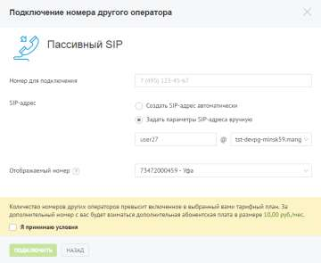

# 4.2.2.1. Пассивный SIP

> Трассировка: PDF §4.2.2.1 · сквозные стр. 76-78 · источники: ч.1 `kb/sources/mango-lk-manual/LK_manual_v-123.pdf` с.76-78.

При выборе пассивного режима переадресация звонков на линию осуществляется сторонним оператором. Допускается только получение входящих вызовов.

Введите необходимые данные в поле «Номер для подключения». Допускается автоматическое создание SIP-адреса, для этого установите переключатель в соответствующее положение. При установке переключателя в положение «Задать параметры SIP-адреса вручную» необходимо указать имя пользователя и выбрать домен SIP из выпадающего списка. В поле «Отображаемый номер» указывается линия, по которой будут маршрутизироваться входящие звонки на SIP-линию при переадресации. Ознакомьтесь с условиями подключения и установите флаг «Я принимаю условия». Для завершения создания номера другого оператора нажмите Подключить. Сообщите вашему оператору новый SIP-адрес. внимание При удалении домена SIP все имена и псевдонимы пользователей, связанные с ним, удаляются без возможности восстановления! совет Если выбранное имя домена занято, появится соответствующее предупреждение. В названии можно использовать только строчные буквы. При вводе прописные автоматически заменяются на строчные. Например, M в имени Mydomain преобразуется в m: mydomain. Удаление номера осуществляется на странице «Номера, подключенные к АТС».

