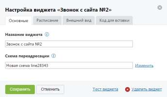

# 4.2.3.2.1. Вкладка «Основные»

> Трассировка: PDF §4.2.3.2.1 · сквозные стр. 81 · источники: ч.1 `kb/sources/mango-lk-manual/LK_manual_v-123.pdf` с.81.

Вид вкладки представлен на рисунке ниже.

На данной вкладке необходимо указать: • Название виджета – название виджета на странице текущей ВАТС; • Схема переадресации – наименование используемой схемы переадресации. Для редактирования или выбора другой схемы нажмите на ссылку «Изменить». В результате будет выполнен переход на страницу настройки голосового меню и распределения звонков. Для сохранения введенных данных нажмите Сохранить.
