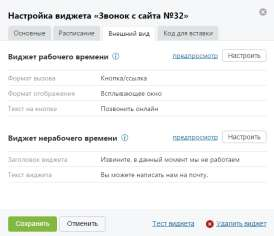
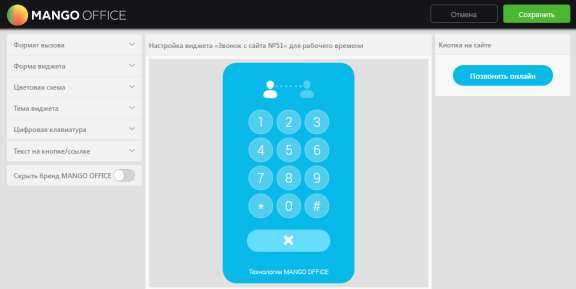
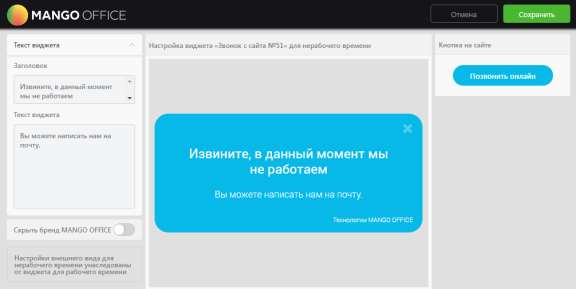

# 4.2.3.2.3. Вкладка «Внешний вид»

> Трассировка: PDF §4.2.3.2.3 · сквозные стр. 83-86 · источники: ч.1 `kb/sources/mango-lk-manual/LK_manual_v-123.pdf` с.83-86.

На данной вкладке указаны основные элементы настройки внешнего вида для виджетов рабочего и нерабочего времени. Вид вкладки представлен на рисунке на следующей странице.

Для предпросмотра внешнего вида настроенного виджета нажмите «предпросмотр» в блоке соответствующего виджета. В результате в новом окне браузера отображается виджет для рабочего/нерабочего времени соответственно. Для настройки внешнего вида нажмите Настроить в блоке соответствующего виджета. Настройка осуществляется в отдельной форме «Настройка внешнего вида виджета для рабочего времени» или «Настройка внешнего вида виджета для нерабочего времени» соответственно. Виджет рабочего времени Вид формы для настройки виджета для рабочего времени представлен на рисунке ниже.

Для настройки используйте набор переключателей в левой области формы. Изменения внешнего вида виджета отображаются в режиме реального времени в центральной области формы. В правой области отображается внешний вид кнопки в том виде, в котором она будет отображаться на сайте. Набор переключателей содержит следующие элементы: Форма вызова • Всплывающее окно – виджет реализован в виде всплывающего окна, вызывается нажатием кнопки/ссылки. Форма виджета • Квадратная – прямые углы виджета/кнопки/ярлыка; • Закругленная – закругленные углы виджета/кнопки/ярлыка. Цветовая схема • Основной цвет – выбор цвета основной области виджета/кнопки/ярлыка; • Дополнительный цвет – выбор цвета дополнительных элементов виджета. Тема виджета • Тема виджета – тема оформления виджета. Цифровая клавиатура • Отображать – включить/отключить отображение цифровой клавиатуры на виджете.

Текст на кнопке/ярлыке • Текст на кнопке/ярлыке – текст, который будет указан на кнопке/ярлыке. Сохранение настроек выполняется после нажатия кнопки Сохранить. При этом форма настройки внешнего вида закрывается и осуществляется возврат к вкладке «Внешний вид». Скрыть бренд MANGO OFFICE • Скрыть бренд MANGO OFFICE – включение/выключение отображения бренда компании на виджете. Виджет нерабочего времени Настройки внешнего вида виджета для нерабочего времени унаследованы от виджета для рабочего времени. Вид формы для настройки виджета для нерабочего времени представлен на рисунке на следующей странице.

Набор переключателей содержит следующие элементы: Текст виджета • Заголовок – текст, который отображается в заголовке виджета; • Текст виджета – дополнительный текст с меньшим размером шрифта. Скрыть бренд MANGO OFFICE • Скрыть бренд MANGO OFFICE – включение/выключение отображения бренда компании на виджете.

Сохранение настроек выполняется после нажатия кнопки Сохранить. При этом форма настройки внешнего вида закрывается и осуществляется возврат к вкладке «Внешний вид».
