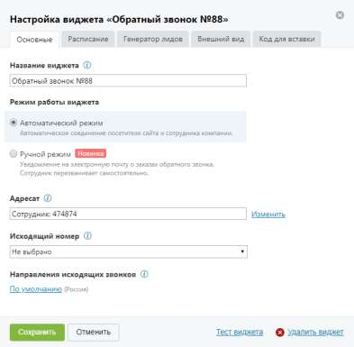

# 4.2.3.3.1. Вкладка «Основные»

> Трассировка: PDF §4.2.3.3.1 · сквозные стр. 87-89 · источники: ч.1 `kb/sources/mango-lk-manual/LK_manual_v-123.pdf` с.87-89.

Вид вкладки представлен на рисунке на следующей странице.

На данной вкладке необходимо указать: • Название виджета – название виджета на странице текущей ВАТС; • Режим работы виджета – выбор режима дозвона до абонента, заказавшего обратный звонок: o Автоматический – соединение абонента и сотрудника компании выполняется автоматически; o Ручной – сотрудник компании получает уведомление о запросе обратного звонка и сам выбирает время для вызова. Для автоматического режима следует задать следующие настройки: • Адресат – выбор группы, сотрудника или внешнего номера для обработки заявок; • Исходящий номер – отображается на определителе номера у абонента; • Направления исходящих звонков – ограничения на исходящие звонки сотрудников. Для ручного режима следует задать следующие настройки: • Электронная почта для получения заявок – один или несколько адресов электронной почты для получения уведомлений о запросах обратного звонка;

• Номер телефона для получения заявок через SMS – один или несколько телефонных номеров для получения уведомлений о запросах обратного звонка в виде SMS-сообщений. Для сохранения введенных данных нажмите Сохранить.
