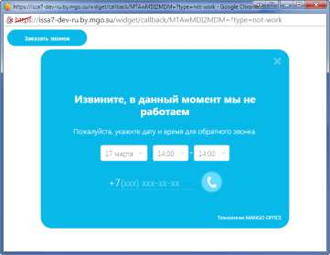

# 4.2.3.3.6. Тест виджета

> Трассировка: PDF §4.2.3.3.6 · сквозные стр. 97 · источники: ч.1 `kb/sources/mango-lk-manual/LK_manual_v-123.pdf` с.97.

На каждой вкладке расположена ссылка «Тест виджета». Она используется для тестирования виджета согласно установленному расписанию и настройкам внешнего вида. При нажатии ссылки виджет открывается в отдельном окне браузера. Нажмите на кнопку или ярлык для отображения виджета.

