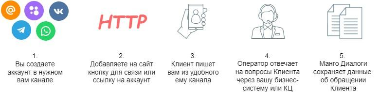

# 1.3. Принцип текстовых коммуникаций с Клиентом при помощи Манго Диалогов

> Трассировка: PDF §1.3 · сквозные стр. 8-9 · источники: ч.1 `kb/sources/mdialogi-api/Manual_API_Mango_Dialogi.pdf` с.8-9.

помощи Манго Диалогов

Рисунок 1 – Текстовые коммуникаций с Клиентом при помощи Манго Диалогов 1) Вы создаете свой аккаунт в том или ином канале коммуникаций, который поддерживает МД. Затем указываете этот аккаунт в настройках групп каналов МД. 2) Чтобы сделать доступным для Клиентов этот сервис, вы можете на вашем сайте разместить кнопку обмена сообщениями МД (2) или просто разместить ссылку на ваш аккаунт на вашем сайте.

Рисунок 2 – Общий вид кнопки обмена сообщениями Манго Диалогов 3) Чтобы написать в вашу компанию, Клиент нажимает на кнопку обмена сообщениями Манго Диалоги и\или переходит в ваш аккаунт в соц. сети. Манго Диалоги. Справочник по API | Версия от 10.06.2026 Когда Клиент отправляет вам первое текстовое сообщение через тот или иной канал коммуникации, тогда внутри МД создается сессия, в которой сохраняются данные о диалоге Клиента с оператором. В зависимости от настроек и содержания, МД может передать сессию в работу тому или иному оператору или группе операторов. 4) Оператор при помощи Контакт-центра MANGO OFFICE (далее по тексту – КЦ) или вашей внешней системы, используя методы и вебхуки API текстовых коммуникаций, принимает сессию в работу и отвечает Клиенту. 5) Диалог Клиента с оператором продолжается до тех пор, пока Клиент или оператор не перестанут отправлять сообщения в течении определенного времени или до тех пор, пока ваш оператор не закроет сессию при помощи КЦ или вашей внешней системы. Весь диалог Клиента с оператором сохраняется в истории сессии. Подробнее о всех возможностях и настройках МД вы можете узнать из пользовательской документации. В этом документе рассказывается только о возможностях доступных в программном интерфейсе системы "Манго Диалоги".
