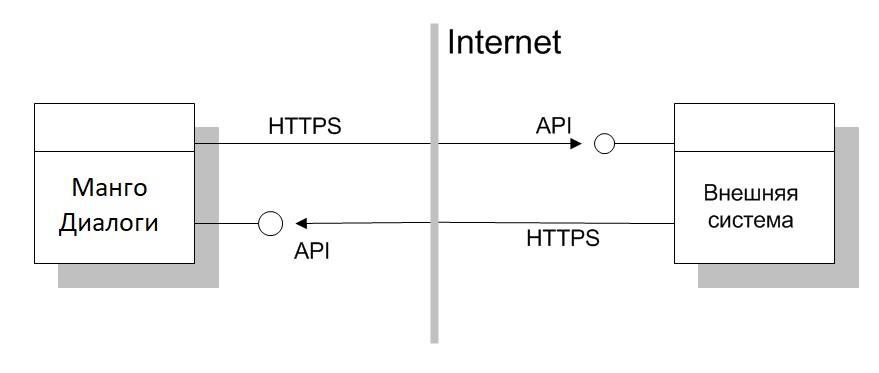

# 2.3.2. Модель взаимодействия

> Трассировка: PDF §2.3.2 · сквозные стр. 12-13 · источники: ч.1 `kb/sources/mdialogi-api/Manual_API_Mango_Dialogi.pdf` с.12-13.

Внешняя система и API взаимодействуют по протоколу HTTPS. Для взаимодействия с некоторыми компонентами API может потребоваться обмен IP-адресами. Такая модель будет работать только с такой внешней системой, которая может предоставить свой внешний (публичный) адрес для ее вызова со стороны API. Типичным примером является B2B взаимодействие между двумя "облачными" сервисами.

Рисунок 3 – Обобщенная схема взаимодействия МД и внешней системы Данные, необходимые для обеспечения взаимодействия систем. От API для внешней системы предоставляются: 1) Базовый адрес API в Интернете, также называемый API BaseURL: https://app.mango-office.ru/cc/md (он же 81.88.85.67) Он используется для формирования запросов к API ВАТС. Пример запроса: https://app.mango-office.ru/cc/md/session/create Манго Диалоги. Справочник по API | Версия от 10.06.2026 Примечение. В примере /cc/md/session/create, запрос на создание сессии. 2) Уникальный код продукта ВАТС "vpbx_api_key". Используется для идентификации внешней системы, от имени которой отправлен запрос; 3) Уникальный ключ "vpbx_api_salt". Используется обеими сторонами для создания подписей сообщений. От внешней системы для API предоставляются базовый адрес внешней системы в Интернете (IP или домен). Пример базового адреса внешней системы: https://external-system.ru Он используется для отправки уведомлений (вебхуки) от API к внешней системе. Пример уведомления: https://external-system.ru/events/cc/md/session/on_pending Примечение. В примере /events/cc/md/session/on_pending, вебхук о создании новой сессии. Важно! В данном документе, во всех примерах уведомлений от API к внешней системе в качестве базового адреса внешней системы будет использоваться условный URL: https://external-system.ru Реальный базовый адрес внешней системы должен быть указан при подключении API.
