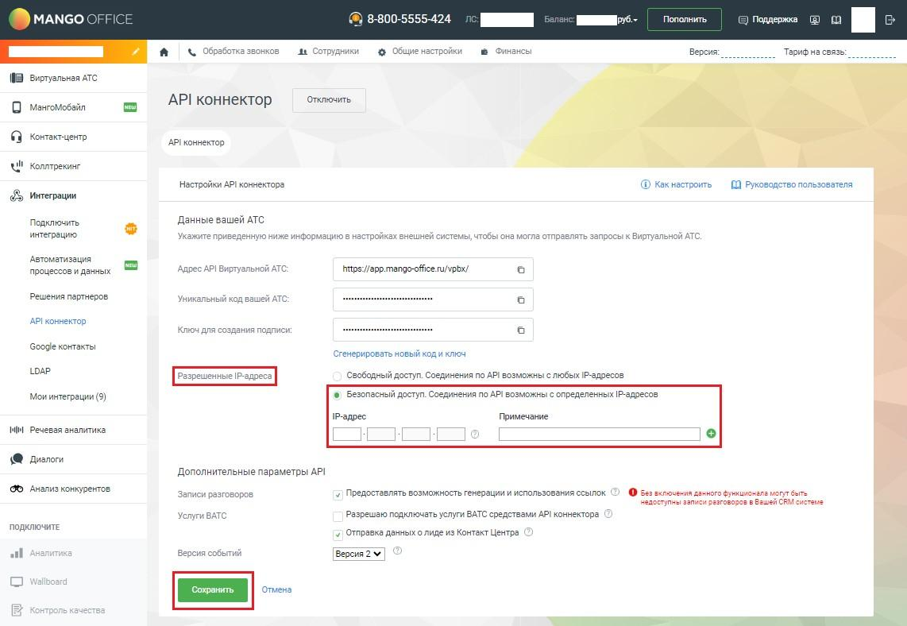

# 2.3.6. Разрешенные IP-адреса

> Трассировка: PDF §2.3.6 · сквозные стр. 15-16 · источники: ч.1 `kb/sources/mdialogi-api/Manual_API_Mango_Dialogi.pdf` с.15-16.

При подключении API коннектора в настройках Личного кабинета MANGO OFFICE можно указать IP-адрес (или несколько IP-адресов), с которых могут приходить запросы от внешней системы к API, для повышения безопасности взаимодействия.

Рисунок 4 – Ввод разрешенных IP-адресов в настройки API коннектора Если при регистрации внешней системы указан IP-адрес(а), то все запросы с «неправильных» IP-адресов будут отвергаться. Манго Диалоги. Справочник по API | Версия от 10.06.2026
