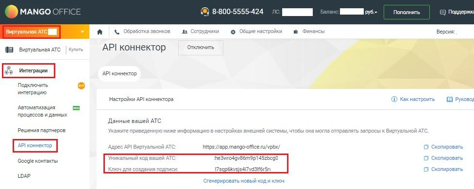

# vpbx_api_salt

> Трассировка: PDF §2.3.7 · сквозные стр. 17-18 · источники: ч.1 `kb/sources/mdialogi-api/Manual_API_Mango_Dialogi.pdf` с.17-18.

Секретный ключ для формирования электронной подписи. Пример значения: 0987654321asdfgh Ключ создания подписи (vpbx_api_salt) используется обеими сторонами для подписания сообщений. Примечание. Ключ не передается в запросах и используется только для генерации подписи. Формирование подписи (sign) Электронная подпись формируется по формуле: sign = sha256(vpbx_api_key + json + vpbx_api_salt) Подпись должна формироваться программно для каждого запроса. Вы можете воспользоваться SHA256 генератор MANGO OFFICE для генерации электронной подписи (sign). Важно! - при изменении тела запроса (json) подпись должна быть пересчитана; - некорректная подпись приведет к ошибке авторизации; - подписываются все запросы и уведомления API. Как получить vpbx_api_key и vpbx_api_salt Чтобы узнать свои данные, в Личном кабинете MANGO OFFICE следует: 1) выберите вашу ВАТС; 2) откройте раздел "Интеграции"; 3) нажмите на пункт меню "API коннектор". На открывшейся странице в одноименных полях будут показаны уникальный код вашей ВАТС Манго Диалоги. Справочник по API | Версия от 10.06.2026 (vpbx_api_key) и ключ для создания подписи (vpbx_api_salt):

Рисунок 5 – Поля API коннектора с данными для подключения к ВАТС
