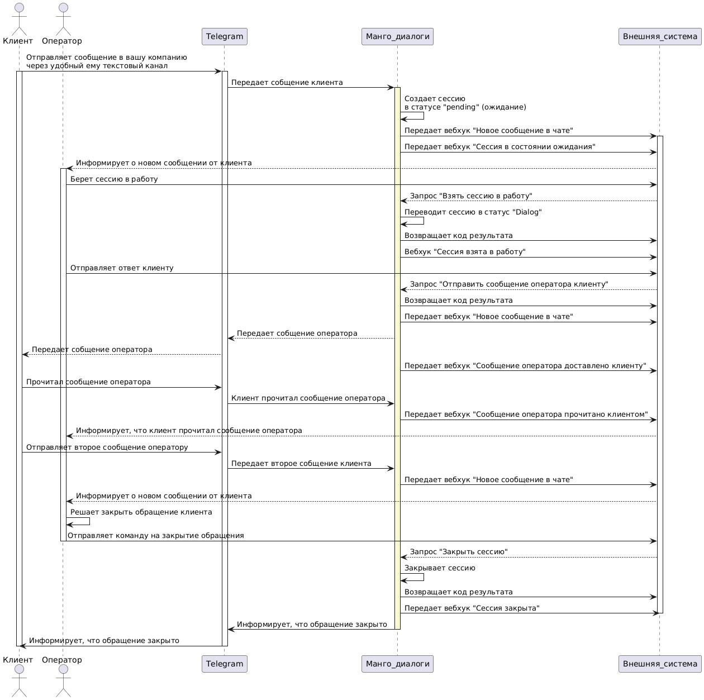

# 5.1. Прием и обработка обращений Клиента

> Трассировка: PDF §5.1 · сквозные стр. 66-73 · источники: ч.1 `kb/sources/mdialogi-api/Manual_API_Mango_Dialogi.pdf` с.66-73.

После настройки каналов коммуникации в МД, вы сможете получать сообщения от Клиентов и отвечать на них. На рисунке ниже описан процесс приема и обработки сообщений Клиента, указано в какой момент в МД создается обращение и как оно переходит в работу к оператору.

Рисунок 6 – Диаграмма взаимодействия при обработке обращений Клиента 1) Когда Клиент отправил первое сообщение, выполняются следующие действия: Манго Диалоги. Справочник по API | Версия от 10.06.2026 - в МД создается новая сессия в статусе "pending" – ожидает распределения на оператора; Примечание. Посмотреть информацию о созданной сессии вы можете при помощи запроса "Получить список активных сессий". - МД отправляет во внешнюю систему: * вебхук "Новое сообщение в чате" (/events/cc/md/session/chat/on_message/), включающий в себя:

|  | { |  |
| --- | --- | --- |
|  | "id": "7e42", |  |
|  | "session_id": "ffqm", |  |
|  | "chat_id": "729d", |  |
|  | "message": { |  |
|  | "message_id": "4442", |  |
|  | "time": 1719217299148, |  |
|  | "direction": "incoming", |  |
|  | "client_id": "558a", |  |
|  | "payload": { |  |
|  | "type": "text", |  |
|  | "text": "Привет!" |  |
|  | } |  |
|  | } |  |
|  | } |  |

* вебхук "Сессия в состоянии ожидания" (/events/cc/md/session/on_pending), включающий в себя:

|  | { |  |
| --- | --- | --- |
|  | "session": { |  |
|  | "session_id": "ffqm", |  |
|  | "widget": { |  |
|  | "widget_id": 1757, |  |
|  | "name": "Мой виджет МД", |  |

Манго Диалоги. Справочник по API | Версия от 10.06.2026

|  | "enabled": true, |  |
| --- | --- | --- |
|  | "channels": [ |  |
|  | { |  |
|  | "channel_id": 8020, |  |
|  | "type": 2, |  |
|  | "mode": "abonent", |  |
|  | "abonent_id": 3002 |  |
|  | } |  |
|  | ] |  |
|  | }, |  |
|  | "update_time": 1719220320372, |  |
|  | "state": "pending", |  |
|  | "variables": { |  |
|  | "social_user": { |  |
|  | "social_user_id": "x8Nt" |  |
|  | } |  |
|  | } |  |
|  | }, |  |
|  | "id": "04b3" |  |
|  | } |  |

2) когда оператор внешней системы берет обращение в работу, от внешней системы к МД должен поступить запрос "Взять сессию в работу" (/cc/md/session/take), включающий в себя:

| { |
| --- |
| "id": "fc30", |
| "session_id": "ffqm", |
| "abonent_id": 3002 |
| } |

Манго Диалоги. Справочник по API | Версия от 10.06.2026 3) получив запрос о взятии сессии в работу, МД присвоит этой сессии статус "dialog" - передана в работу оператору. Затем от МД к внешней системе будет отправлен: - результат обработки запроса с кодом 200 ОК. Пример результата:

| { |
| --- |
| "name": "OK", |
| "status": 200, |
| "code": 1000 |
| } |

- вебхук "Сессия взята в работу" (/events/cc/md/session/on_dialog), включающий в себя:

|  | { |  |
| --- | --- | --- |
|  | "session": { |  |
|  | "session_id": "ffqm", |  |
|  | "widget": { |  |
|  | "widget_id": 1757, |  |
|  | "name": "Мой виджет МД", |  |
|  | "enabled": true, |  |
|  | "channels": [ |  |
|  | { |  |
|  | "channel_id": 8020, |  |
|  | "type": 2, |  |
|  | "mode": "abonent", |  |
|  | "abonent_id": 3002 |  |
|  | } |  |
|  | ] |  |
|  | }, |  |
|  | "update_time": 1719, |  |
|  | "state": "dialog", |  |
|  | "variables": { |  |
|  | "social_user": { |  |
|  | "social_user_id": "x8Nt" |  |
|  | } |  |
|  | }, |  |
|  | "group_id": null, |  |
|  | "abonent_id": 3002, |  |

Манго Диалоги. Справочник по API | Версия от 10.06.2026

|  | "chat": { |  |
| --- | --- | --- |
|  | "chat_id": "729d", |  |
|  | "client_id": "558a" |  |
|  | } |  |
|  | }, |  |
|  | "id": "c37f" |  |
|  | } |  |

4) когда оператор сформирует и отправит ответ Клиенту, от внешней системы к МД необходимо отправить запрос "Отправить сообщение оператора к клиенту (/cc/md/session/chat/send_message)", включающий в себя:

| { |
| --- |
| "id": "c603", |
| "chat_id": "729d", |
| "abonent_id": 3002, |
| "local_message_id": "1678", |
| "payload": { |
| "type": "text", |
| "text": "Привет, наш новый Клиент!" |
| } |
| } |

5) МД выполнит следующие действия: - отобразит ответ оператора Клиенту в диалоге оператор с Клиентом (в канале коммуникаций); - от МД к внешней системе будут отправлены: * результат обработки запроса с кодом 200 ОК. * Пример результата:

| { |
| --- |
| "name": "OK", |
| "status": 200, |
| "code": 1000 |
| } |

* вебхук "Новое сообщение в чате (/events/cc/md/session/chat/on_message/)", который включает в себя: Манго Диалоги. Справочник по API | Версия от 10.06.2026

|  | { |  |
| --- | --- | --- |
|  | "id": "b649", |  |
|  | "session_id": "ffqm", |  |
|  | "chat_id": "729d", |  |
|  | "message": { |  |
|  | "message_id": "4442", |  |
|  | "local_message_id": "NoRnNpGK6XIfujtGjhXz", |  |
|  | "time": 1719, |  |
|  | "direction": "outgoing", |  |
|  | "abonent_id": 3002, |  |
|  | "payload": { |  |
|  | "type": "text", |  |
|  | "text": "Привет, наш новый Клиент!" |  |
|  | } |  |
|  | } |  |
|  | } |  |

* вебхук "Сообщение оператора доставлено клиенту (/events/cc/md/session/on_recv_message)", включающий в себя:

|  | { |  |
| --- | --- | --- |
|  | "vpbx_api_key": "123qwerty", |  |
|  | "sign": "456qwerty", |  |
|  | "json": { |  |
|  | "id": "9277", |  |
|  | "chat_id": "729d", |  |
|  | "abonent_id": 3002, |  |
|  | "message_id": "4442" |  |
|  | } |  |
|  | } |  |

* вебхук "Сообщение оператора прочитано клиентом (/events/cc/md/session/on_read_message)", включающий в себя:

|  | { |  |
| --- | --- | --- |
|  | "id": "bdd5", |  |
|  | "chat_id": "729d", |  |
|  | "abonent_id": "3002", |  |

Манго Диалоги. Справочник по API | Версия от 10.06.2026

|  | "message_id": "4442" |  |
| --- | --- | --- |
|  | } |  |
|  | } |  |

6) Когда Клиент набирает вам второе и последующее сообщение, МД отправляет к внешней системе вебхук "Клиент печатает (/events/cc/md/session/chat/on_typing)", включающий в себя:

|  | { |  |
| --- | --- | --- |
|  | "chat_id": "729d", |  |
|  | "client_id": "558a", |  |
|  | "typing": true, |  |
|  | "id": "e918" |  |
|  | } |  |
|  | } |  |

7) когда Клиент отправит вам второе и последующее сообщение, от МД к внешней системе будет отправлен вебхук "Новое сообщение в чате" (/events/cc/md/session/chat/on_message/), включающий в себя:

|  | { |  |
| --- | --- | --- |
|  | "id": "e528", |  |
|  | "session_id": "ffqm", |  |
|  | "chat_id": "729d", |  |
|  | "message": { |  |
|  | "message_id": "4442", |  |
|  | "local_message_id": "NoRnNpGK6XIfujtGjhXz", |  |
|  | "time": 1719223490589, |  |
|  | "direction": "incoming", |  |
|  | "client_id": "558a", |  |
|  | "payload": { |  |
|  | "type": "text", |  |
|  | "text": "мое второе сообщение" |  |

Манго Диалоги. Справочник по API | Версия от 10.06.2026

|  | } |  |
| --- | --- | --- |
|  | } |  |
|  | } |  |

Диалог Клиента с оператором продолжается до тех пор, пока Клиент или оператор не перестанут отправлять сообщения в течении определенного в настройках МД времени или до тех пор, пока ваш оператор не закроет обращение при помощи запроса "Сессия закрыта (/cc/md/session/close)".
