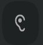

# Управление аудио звонком

> Трассировка: PDF §— · сквозные стр. 16-19 · источники: ч.1 `kb/sources/mtalker/UserGuide_mTalker_4Mobile 11.06.26.pdf` с.16-19.

Общие сведения Во время звонка, вы можете использовать следующие функции управления звонком:

| Функция | Пояснение |
| --- | --- |
| Выключить звук | Выключить микрофон, звуковой сигнал с вашего микрофона больше не будет передаваться в текущий сеанс связи и ваши собеседники вас не услышат. |
| Звук | Переключение между режимами ”громкий динами” и “разговорный динамик” |
| Запись | Включение/выключение записи разговора. Данная функция может быть не доступна, в зависимости от настроек вашей ВАТС. |
| Перевести | Перевод вызова на того или иного абонента, записанного в телефонной книге. |
| Переключить | Перевод вызова на другое ваше устройство. Например, если вы разговариваете через мобильное приложение MTalker и у вас на рабочем ПК установлено “десктопное” приложение MTalker, то с помощью данной кнопки, вы можете перевести звонок с вашего мобильного на ваш рабочий ПК и продолжить разговор, через рабочий ПК. |
| Сообщение | Создать чат “Один-на-один”. Данная функция доступна только, если абонент записан в телефонную книгу. |
| Удержание | Удержание вызова |
| Завершение вызова | Положить трубку, завершив свое участие в данном сеансе связи. При этом, если вы принимали участие в групповом вызове, то сеанс связи будет завершен только для вас. Остальные участники продолжат сеанс связи. |
| Показать экранную клавиатуру | Отображение экранной клавиатуры в окне проведения сеанса связи. |

Завершение вызова

Для того чтобы завершить вызов, в окне проведения сеанса связи нажмите кнопку . Будет выполнено одно из следующих действий: Mango Talker для ОС Android. Руководство пользователя | Версия от 11.06.2026 • если проводился групповой сеанс связи, то вы выйдете из сеанса связи, при этом остальные собеседники продолжат общение; • если выполнялся звонок “один-на-один”, то будет завершен сеанс связи. Оценка качества связи и баннер видеоконференций После завершения аудиозвонка отображается экран оценки качества связи. Дополнительно отображается баннер с предложением использовать видеоконференции. Выключить микрофон

Чтобы выключить свой микрофон во время звонка, нажмите кнопку “Выкл. звук” . Тогда будет выключен ваш микрофон и ваши собеседники вас не услышат. Чтобы обратно включить микрофон, снова нажмите на кнопку “Выкл. звук” и ваш микрофон будет включен. Как включить громкую связь

Чтобы включить громкую связь, нажмите на кнопку “Звук” (кнопка включения громкой связи). Будет открыто всплывающее меню “Звук”, в котором нажмите на пункт “Громкий

динамик”. Будет включен разговор по громкой связи и на экране отображена кнопка .

Чтобы выключить громкую связь, нажмите на кнопку “Звук” (кнопка выключения громкой связи). Будет открыто всплывающее меню “Звук”, в котором нажмите на пункт “Разговорный динамик”. Будет выключен разговор по громкой связи и на экране отображена

кнопка . Запись разговора В зависимости от настроек вашей ВАТС, функция “Запись разговора” может быть включена по умолчанию или совсем недоступна. По умолчанию разговор всегда записывается, если функция записи разговора подключена к вашей ВАТС. Запись начинается в момент, когда вызываемые абонент принимает звонок, при этом на экране

MTalker во время разговора будет отображена иконка и указана длительность записи . Если запись ведется, то эта кнопка горит красным цветом и под ней отображается длительность записи; Mango Talker для ОС Android. Руководство пользователя | Версия от 11.06.2026 Перевод вызова на другого сотрудника Чтобы перевести звонок на того или иного сотрудника, зарегистрированного в вашей ВАТС, в окне проведения сеанса связи следует: 1) нажмите кнопку “Перевести”; 2) выберите тип перевода: – слепой перевод: перевод на любого сотрудника; – консультативный: перевод для консультации с сотрудником; 3) выберите сотрудника, на которого нужно перевести вызов, может потребоваться выбрать номер телефона сотрудника (например, на внутренний номер). Переключение между вашими устройствами Если вы уже вошли в ваш аккаунт MTalker на нескольких устройствах, например, на мобильном телефоне и на рабочем ПК, то вы можете перевести звонок с одного вашего устройства на другое. Например, если вы разговариваете через мобильное приложение MTalker и у вас на рабочем ПК установлено “десктопное” приложение MTalker, то с помощью данной кнопки, вы можете перевести звонок с вашего мобильного на ваш рабочий ПК и продолжить разговор, через рабочий ПК. Чтобы перевести звонок на другое ваше устройство, в окне проведения сеанса связи следует:

1) нажмите кнопку “Переключить” ; 2) выберите устройство ваше, на которое будет переведен звонок. Отправить сообщение абоненту Вы можете отправить сообщение абоненту, прямо во время звонка. Для этого, в окне проведения сеанса связи следует:

1) нажмите кнопку “Сообщение” . Вы перейдете в чат “Один-на-один”; 2) нажмите на поле “Сообщение” (поле ввода текста) и введите текст сообщения;

3) нажмите кнопку . Будет отправлено текстовое сообщение вашему собеседнику. А чтобы отправить собеседнику фотографию, файл, видео, следует в поле для ввода текста нажать кнопку “Плюс” и выбрать файл, который будет отправлен. Удержание вызова

Чтобы перевести вызов на удержание, в окне проведения сеанса связи следует . Нажмите на нее, будет переведен вызов в режим удержания и в окне проведения сеанса связи отображено время удержания вызова на линии. Mango Talker для ОС Android. Руководство пользователя | Версия от 11.06.2026
