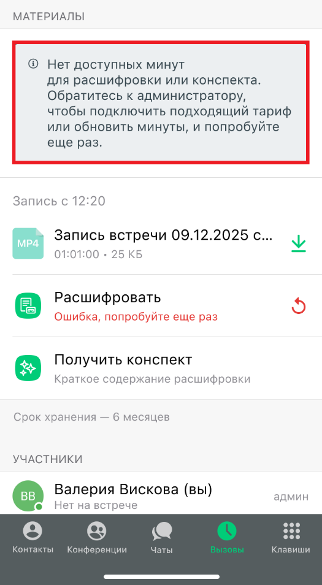
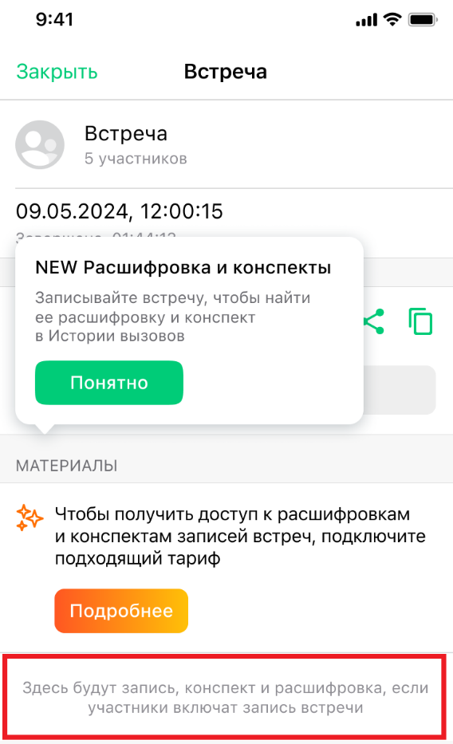
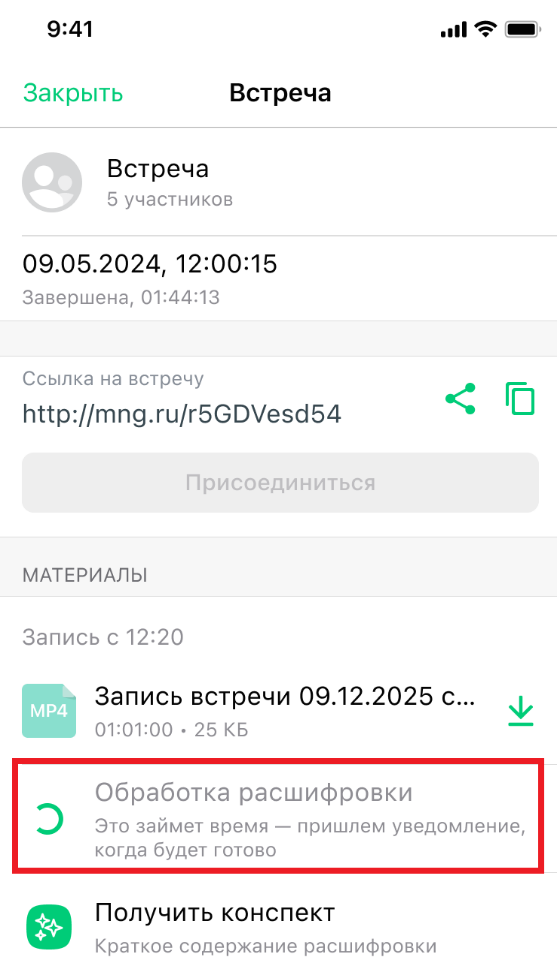
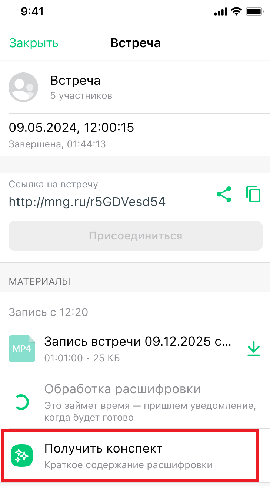
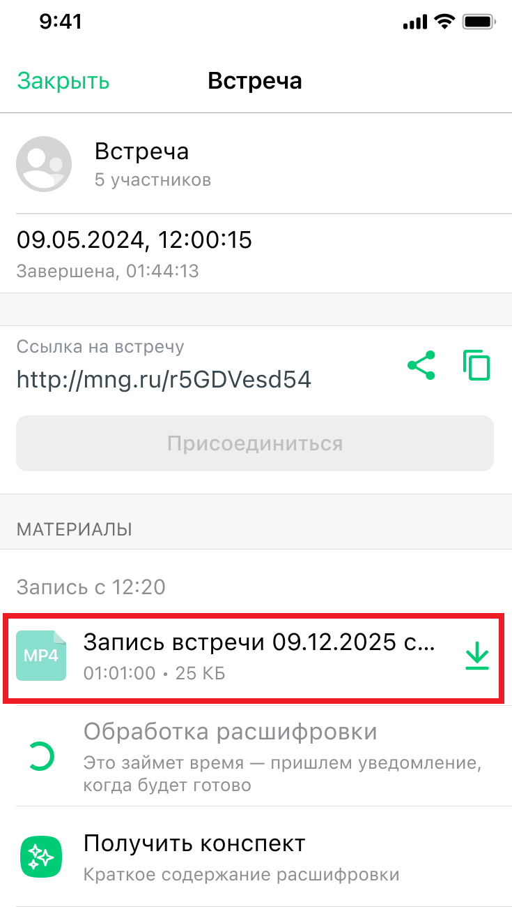
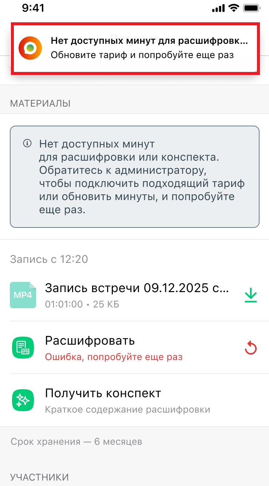

# Расшифровка и конспектирование записей встреч

> Трассировка: PDF §— · сквозные стр. 22-27 · источники: ч.1 `kb/sources/mtalker/UserGuide_mTalker_4Mobile 11.06.26.pdf` с.22-27.

Общие сведения Расшифровка позволяет преобразовать запись видеоконференции в текстовый формат. Конспектирование позволяет получить краткое содержание записи видеоконференции на основе расшифровки. Функции доступны пользователям, у которых подключена услуга “Групповая видеоконференция” и имеются доступные минуты для обработки записей. Если услуга не подключена Если услуга “Групповая видеоконференция” не подключена, в карточке видеоконференции отображается информационный блок с предложением подключить подходящий тариф. Для получения дополнительной информации нажмите кнопку Подробнее.

Mango Talker для ОС Android. Руководство пользователя | Версия от 11.06.2026 Если запись отсутствует Если запись видеоконференции отсутствует, в карточке видеоконференции отображается сообщение: “Здесь будут запись, конспект и расшифровка, если участники включат запись встречи”.

Получение расшифровки Для получения расшифровки: 1. Откройте карточку видеоконференции. 2. Перейдите к блоку с материалами встречи. 3. Выберите запись видеоконференции. 4. Нажмите “Расшифровать“. После отправки записи на обработку отображается статус выполнения операции. Mango Talker для ОС Android. Руководство пользователя | Версия от 11.06.2026

Получение конспекта Для получения конспекта: 1. Откройте карточку видеоконференции. 2. Перейдите к блоку с материалами встречи. 3. Выберите запись видеоконференции. 4. Нажмите “Получить конспект“. Конспект формируется автоматически на основе расшифровки записи видеоконференции. Mango Talker для ОС Android. Руководство пользователя | Версия от 11.06.2026

Готовые материалы встречи После завершения обработки запись видеоконференции отображается в карточке видеоконференции и доступна для скачивания. Mango Talker для ОС Android. Руководство пользователя | Версия от 11.06.2026

Недостаточно минут для обработки Если лимит минут для расшифровки или конспектирования исчерпан, при попытке запуска обработки отображается сообщение: “Нет доступных минут для расшифровки или конспекта. Обратитесь к администратору, чтобы подключить подходящий тариф или обновить минуты, и попробуйте еще раз”. После увеличения лимита минут обработку можно запустить повторно. Mango Talker для ОС Android. Руководство пользователя | Версия от 11.06.2026

