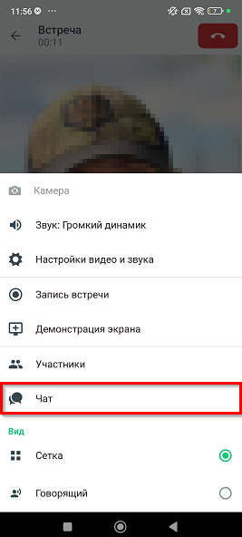
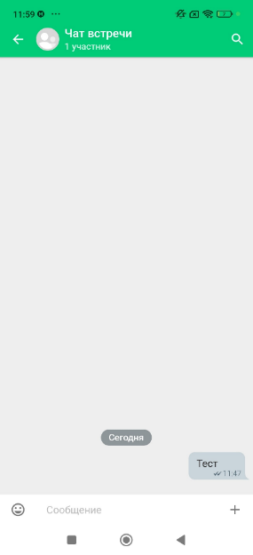
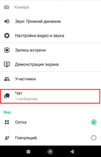

# Чат во время видеоконференции

> Трассировка: PDF §— · сквозные стр. 27-29 · источники: ч.1 `kb/sources/mtalker/UserGuide_mTalker_4Mobile 11.06.26.pdf` с.27-29.

Во время видеоконференции в MTalker доступен чат для обмена сообщениями между участниками. Чтобы открыть чат во время видеоконференции, в окне видеоконференции следует нажать

кнопку , затем нажать на пункт “Чат”. Будет открыто окно чата встречи. Mango Talker для ОС Android. Руководство пользователя | Версия от 11.06.2026

В чате вы можете: • отправлять текстовые сообщения; • отправлять изображения, ссылки и файлы; • отвечать на сообщения; • удалять отправленные сообщения.

При поступлении нового сообщения на кнопке чата отображается индикатор новых сообщений . Mango Talker для ОС Android. Руководство пользователя | Версия от 11.06.2026

Примечание. Чат видеоконференции является временным и не отображается в списке чатов MTalker.
