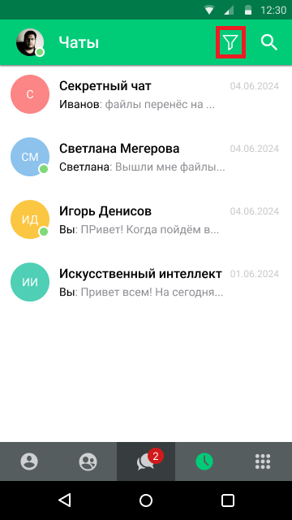
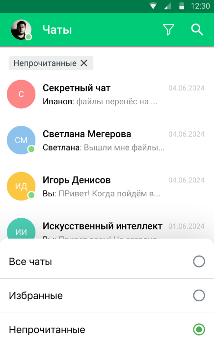

# Фильтр чатов по непрочитанным сообщениям

> Трассировка: PDF §— · сквозные стр. 32-34 · источники: ч.1 `kb/sources/mtalker/UserGuide_mTalker_4Mobile 11.06.26.pdf` с.32-34.

В MTalker вы можете отфильтровать список чатов по наличию непрочитанных сообщений. Доступны следующие варианты отображения: • Все чаты — отображаются все чаты пользователя; • Непрочитанные — отображаются только чаты, в которых есть непрочитанные сообщения. Чтобы включить фильтр по непрочитанным сообщениям, на закладке “Чаты” следует: Mango Talker для ОС Android. Руководство пользователя | Версия от 11.06.2026

1. нажать на кнопку фильтра в верхней части экрана;

2. в открывшемся списке выбрать пункт “Непрочитанные”.

Будут показаны только чаты, в которых есть непрочитанные сообщения. Чтобы снова отобразить все чаты, на закладке “Чаты” следует:

<!-- изображение на стр. 33: байты не извлечены (PyMuPDF недоступен) -->

1. нажать на кнопку фильтра ; 2. в открывшемся списке выбрать пункт “Все чаты”. Будут показаны все чаты пользователя. Mango Talker для ОС Android. Руководство пользователя | Версия от 11.06.2026 Примечание. Список чатов сортируется по дате последнего сообщения в соответствии с текущей логикой приложения. При прочтении сообщений в чате, такой чат автоматически исчезает из списка “Непрочитанные”.
