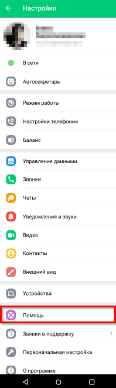
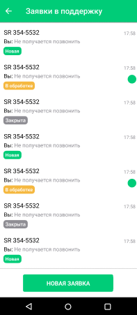
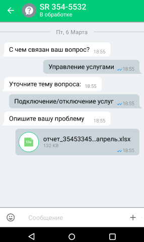
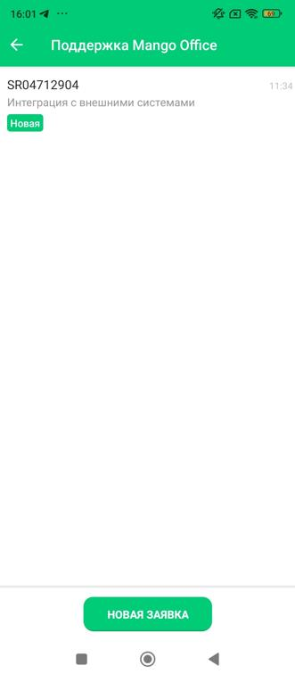
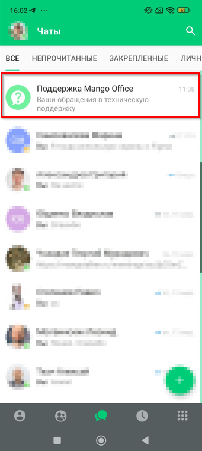

# Работа с техподдержкой

> Трассировка: PDF §— · сквозные стр. 35-40 · источники: ч.1 `kb/sources/mtalker/UserGuide_mTalker_4Mobile 11.06.26.pdf` с.35-40.

Вы можете создавать заявки в техническую поддержку и получать ответы на них в чате. Mango Talker для ОС Android. Руководство пользователя | Версия от 11.06.2026 Открытие раздела техподдержки Для того чтобы открыть раздел с заявками в техподдержку, в MTalker следует: 1. перейти в раздел “Профиль”; 2. выбрать пункт “Помощь”.

Список заявок В списке заявок отображаются:  номер заявки;  категория обращения;  статус заявки;  дата последнего обновления;  наличие новых сообщений. Mango Talker для ОС Android. Руководство пользователя | Версия от 11.06.2026 Если заявки отсутствуют, будет показано сообщение “Здесь появятся ваши заявки в техническую поддержку”. Для создания новой заявки нажмите кнопку “Новая заявка”.

Создание заявки Для того чтобы создать заявку, в разделе “Поддержка Mango Talker” следует: 1. нажать кнопку “Новая заявка”; 2. выбрать категорию обращения; 3. выбрать тему вопроса; 4. ввести текст сообщения с описанием проблемы; 5. при необходимости прикрепить файл или изображение; 6. нажать кнопку отправки сообщения. Mango Talker для ОС Android. Руководство пользователя | Версия от 11.06.2026

7. После отправки сообщения будет создана заявка в техническую поддержку с уникальным номером.

Mango Talker для ОС Android. Руководство пользователя | Версия от 11.06.2026 Уведомления При изменении статуса заявки или получении ответа от технической поддержки отображается уведомление. Если уведомления отключены, наличие новых сообщений отображается в списке заявок.

Mango Talker для ОС Android. Руководство пользователя | Версия от 11.06.2026 Чат “Поддержка Mango Talker” В разделе “Чаты” отображается чат “Поддержка Mango Talker”. Для того чтобы открыть список заявок, в разделе “Чаты” следует: 1. найти чат “Поддержка Mango Talker”; 2. нажать на строку с названием чата; 3. будет открыт список созданных вами заявок.

