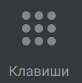
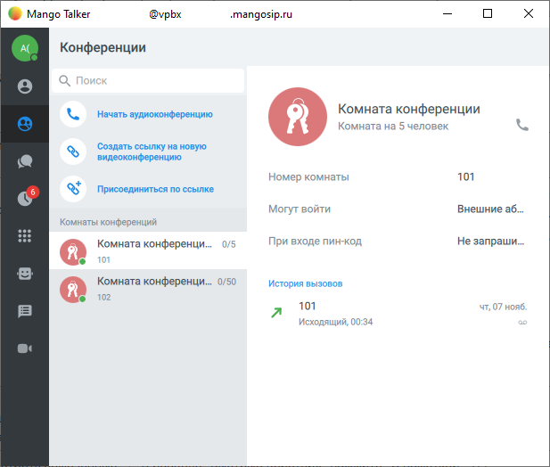

# 1.3. Навигация

> Трассировка: PDF §1.3 · сквозные стр. 11-20 · источники: ч.1 `kb/sources/mtalker/UserGuide_Windows_mTalker_ch1_Working.11.06.26.pdf` с.11-20.

Главное окно и доступ к разделам MTalker Общее В главном окне MTalker в меню слева доступно несколько разделов:

Основное меню и профиль пользователя (данные пользователя)

Контакты (адресная книга компании)

Конференции

Чаты

История вызовов

Клавиши (экранная клавиатура)

Автосекретарь

SMS-рассылки

Видеоконференции

Опционально отображаются кнопки для перехода в интернет-магазине “Google Play” и в “App Store” В правой части главного окна MTalker - поле для отображения содержимого того или иного раздела. Mango Talker для сред ОС Windows и Mac. Руководство пользователя | Версия от 11.06.2026

Основное меню и профиль пользователя

Чтобы открыть основное меню и профиль пользователя, следует нажать на кнопку . Будет открыт раздел “Основное меню и профиль пользователя”, в котором отображаются:

• Имя пользователя: пункт для перехода в профиль пользователя;

• Настройки телефонии: вы можете выбрать исходящий номер, с которого будут звонить, а также можете настроить средства приема звонков;

• Основные: основные настройки MTalker;

• Управление данными: вы можете удалить данные о звонках и сообщениях;

• Звонки: настройка работы с аудио звонком;

• Чаты: настройка работы с чатом;

• Уведомления: настройка показа уведомлений и мелодий ;

• Видео: настройка работы с камерой;

• Звук: настройки громкости динамиков и микрофона;

• Устройства: перечень устройств, на которых выполнен вход в MTalker;

• Сетевое подключение: настройки сетевого подключения;

• Поддержка: контакты технической поддержки;

• О программе: вызов окна с номером версии MTalker. Профиль пользователя, авторизованного в MTalker

Чтобы открыть профиль пользователя, следует нажать на кнопку в основном меню MTalker. Будет открыт профиль пользователя, авторизованного в MTalker, в котором отображаются следующие данные: Mango Talker для сред ОС Windows и Mac. Руководство пользователя | Версия от 11.06.2026 1) ваш аватар и ваши инициалы; 2) ваш статус в MTalker; 3) ваши контактные данные: – ваша должность и название вашего структурного подразделения; – контактные данные: электронный адрес, sip-учетка, внутренний номер; 4) пункт “Сменить пользователя” для выхода из профиля MTalker; 5) пункт “Выйти” для завершения работы MTalker. Настройки телефонии

Чтобы открыть настройки телефонии, следует нажать на кнопку в основном меню MTalker. В данном разделе показаны настройки приема и совершения вызовов, установленные в вашей учетной записи: 1) исходящий номер: вы можете выбрать номер, с которого будете звонить. Именно этот номер увидит абонент на своем определителе номера; 2) средства приема звонков: в этой настройке отображается, на какой из ваших телефонов будут поступать входящие звонки. Основные

Чтобы открыть основные настройки , следует нажать на кнопку в основном меню MTalker. В данном разделе показаны основные настройки работы вашего MTalker: • Запускать программу при запуске системы: если включена, то MTalker будет автоматически запускаться на вашем ПК при запуске работы операционной системы; • При автозапуске открывать приложение в свернутом состоянии: если включена, то MTalker будет автоматически запускаться в фоновом режиме при запуске работы операционной системы вашего компьютера; • Использовать глобальные горячие клавиши: если включена, то вы можете использовать комбинацию “горячих” клавиш на клавиатуре для выполнения определенных действий в вашем MTalker; • группа настроек “Интерфейс” содержит настройки отображения MTalker: – Язык: вы можете выбрать язык интерфейса MTalker. Доступен выбор: русский, английский; Важно! После смены языка интерфейса, следует перезагрузить MTalker для применения настроек языка. – Рендеринг: служебная настройка качества отображения интерфейса. Если интерфейс MTalker на вашем ПК отображается некорректно, попробуйте обновить драйвер видеокарты и установить данную настройку; • группа настроек “Обработка ссылок” содержит настройки: – Использовать MANGO TALKER для обработки кликов на ссылки: по умолчанию включена. При включенной настройке, если вы нажмете на номер телефона (например, в вашей CRM) вам будет предложено выполнить звонок через MTalker Mango Talker для сред ОС Windows и Mac. Руководство пользователя | Версия от 11.06.2026 • группа настроек “Подтверждение действий” используется для включения и выключения окна подтверждения ваших действий в MTalker: выход из MTalker, смена пользователя и т.д. Управление данными

Чтобы открыть раздел “Управление данными”, следует нажать на кнопку в основном меню MTalker. В данном разделе предоставлена возможность удалить некоторые данные о пользователе MTalker. Вы можете удалить следующие данные о своем аккаунте: • Удалить сообщения: будут удалены все сообщения из чатов, а также произойдет выход из всех групп; • Удалить историю вызовов: вы можете очистить всю историю вызовов; • Удалить контакты: вы можете удалить все свои контакты из списка контактов MTalker. Звонки

Чтобы открыть раздел “Управление данными”, следует нажать на кнопку в основном меню MTalker. В данном разделе вам доступны настройки обработки звонков: • Автоматически переключать фокус при входящем звонке: если включена, то, при входящем звонке, автоматически станет активно окно MTalker. Кроме того, если настройка включена, то, чтобы принять звонок, вам нужно нажать кнопку “Enter”, а чтобы отклонить звонок нажмите кнопку “Esc”; • Сохранять положение виджета на экране: если настройка включена, то во время звонка окно MTalker будет закреплено на экране; • Входящие вызовы во время активного звонка: вы можете выбрать действие, которое будет выполняться при втором входящем звонке: – Показывать: если включена, то, при поступлении второго входящего звонка, об этом входящем звонке будет выдано сообщение на экран; – Сбрасывать: если включена, то все вторые звонки, поступающие во время обработки первого звонка, будут сброшены автоматически. Информацию о сброшенных звонках будет показана в Истории вызовов; – Скрывать: если включена, то, при поступлении второго входящего звонка, об этом входящем звонке НЕ будет выдано сообщение на экран. • Не удалять символы из номеронабирателя: если включена, то последний номер, набранный на экранной клавиатуре, будет отображаться на экранной клавиатуре; • группа полей “Автоподнятие трубки”: – Автоподнятие трубки через 3 секунды: если включена, то входящий звонок будет автоматически принят через 3 секунды после того, как поступил в MTalker; – Автоподнятие трубки для исходящих звонков из CRM-систем: если включена, то исходящий звонок из Amo и Битрикс24 будет автоматически принят в MTalker; • группа полей “Внешний телефон”: – Использовать внешний телефон: если включена, то все входящие звонки будут перенаправлены на указанный вами SIP-ID или номер телефона; • группа полей “Оценка качества связи”: – Участвовать в оценке качества связи: по умолчанию включена. Если включена, то после завершения звонка вам будет предложено оценить качество связи в MTalker; Mango Talker для сред ОС Windows и Mac. Руководство пользователя | Версия от 11.06.2026 • группа полей “Оценка качества связи”: – Участвовать в оценке качества связи: по умолчанию включена. После завершения звонка, вам будет предложено указать оценку качества связи; – Дополнительно: служебные настройки. Чаты

Чтобы открыть раздел “Чаты”, следует нажать на кнопку в основном меню MTalker. В данном разделе доступны настройки работы чатов: • Отправка сообщений: настройка отправки сообщения в чате. По умолчанию сообщения отправляются при нажатии кнопки “Enter”; • группа полей “Файлы”: – Расположение загружаемых файлов: настройка папки для загрузки файлов; – Запрашивать место для сохранения каждого файла перед загрузкой: если включена, то при сохранении файла, полученного в чате, на экран будет выводиться сообщение о том, в какую папку надо сохранить файл; – Автоматически скачивать изображения: если включена, то все входящие изображения будут автоматически сохраняться на вашем ПК; • Отметить все чаты и звонки просмотренными: кнопка, чтобы отметить все входящие сообщения и звонки просмотренными. Уведомления

Чтобы открыть раздел “Уведомления”, следует нажать на кнопку в основном меню MTalker. В данном разделе отображены настройки уведомлений в MTalker: • Рингтон: выбор звукового оповещения при входящем звонке; • Звуковое уведомление о входящем сообщении: настройка для включения и выключения звукового оповещения о входящем сообщении; • группа полей “Показ уведомлений”: вы можете включить или выключить показ уведомлений в личных чатах, в группах и каналах; • группа уведомлений “Email уведомления”: – Уведомления о событиях: вы можете посмотреть электронную почту, на которую будут отправляться уведомления о событиях в MTalker. А также, вы можете посмотреть режим отправки уведомлений. Видео

Чтобы открыть раздел “Видео”, следует нажать на кнопку в основном меню MTalker. В данном разделе доступна настройка видеоконференций: • Видеоконференции: – Открывать видеозвонки во внешнем браузере: по умолчанию выключена. Если включить настройку, в этом случае все видеозвонки и видеоконференции будут открываться в браузере на вашем ПК, а не в окне MTalker. Mango Talker для сред ОС Windows и Mac. Руководство пользователя | Версия от 11.06.2026 Звук

Чтобы открыть раздел “Звук”, следует нажать на кнопку в основном меню MTalker. В данном разделе доступны служебные настройки микрофона и наушников: • Динамики вывода голоса: вы можете выбрать устройство вывода звука, если у вас их несколько (наушники или встроенные динамики ПК). Кроме того, вы можете настроить громкость устройства вывода звука и протестировать их работу; • Динамики вывода рингтона: вы можете выбрать устройство вывода звука уведомления, а также настроить громкость устройства и проверить их работу; • Микрофон: настройка громкости микрофона и проверка его работы; • Громкость прочих приложений при звонке: настройка громкости уведомлений прочих приложений, установленных на вашем ПК, во время звонка; • ссылка “Перейти в системные настройки звуковых устройств” для перехода к системным настройкам вашего ПК; • Автоматическая регулировка Устройства

Чтобы открыть раздел “Устройства”, следует нажать на кнопку в основном меню MTalker. В данном разделе отображается перечень устройств, на которых выполнен вход в ваш аккаунт MTalker. В этом разделе вы можете выполнить удаленный выход из аккаунта MTalker. Сетевое подключение

Чтобы открыть раздел “Сетевое подключение”, следует нажать на кнопку в основном меню MTalker. В данном разделе доступны служебные настройки подключения к сети через прокси- сервер. Поддержка

Чтобы открыть раздел “Поддержка”, следует нажать на кнопку в основном меню MTalker. В данном разделе доступны следующие элементы: • Частые вопросы: вы можете увидеть список часто задаваемых вопросов и ответов на них прямо в интерфейсе MTalker; • Приложение будет добавлено в исключения Windows Firewall: служебная кнопка для автоматического добавления MTalker в исключения Windows Firewall для возможного устранения неполадок с соединением; • Помощь: ссылка для перехода к пользовательской документации MTalker на сайте www.mango-office.ru; • Очистка данных: служебная кнопка для очитки данных MTalker; • Отправить отчет об ошибке: кнопка для отправки сообщения об ошибке в работе MTalker разработчикам MTalker; • Контакты технической поддержки: перечень контактов техническое поддержки MANGO OFFICE; Mango Talker для сред ОС Windows и Mac. Руководство пользователя | Версия от 11.06.2026 • Помощь удаленно: служебная ссылка для скачивания программы удаленного удаления вашим компьютером “TeamViawer”. О программе

Чтобы открыть раздел “О программе”, следует нажать на кнопку в основном меню MTalker. В данном разделе доступны следующие элементы: • кнопка Проверить: вы можете нажать эту кнопки и проверить выход обновления MTalker; • Автоматически обновлять приложение: переключатель для включения и выключения авто обновления MTalker; • юридическая информация о MTalker. Контакты Раздел “Контакты” предназначен для доступа к телефонному справочнику и журналу звонков.

Чтобы открыть раздел “Контакты”, следует в основном окне MTalker нажать на кнопку . Будет открыт раздел “Контакты”, на котором отображаются следующие элементы интерфейса:

1) кнопка отображения групп контактов из телефонного справочника;

2) кнопка для добавления контакта;

3) поле для поиска контакта; 4) список контактов; 5) группа полей для показа детальных данных контакта. Конференции Раздел “Конференции” предназначен для работы с виртуальными комнатами конференций. Примечание. Виртуальная комната конференции создается и настраивается в Личном кабинете MANGO OFFFICE. Доступ к ней сотрудников также настраивается в Личном кабинете. Подробнее о комнатах конференций читайте в Справочнике абонента (ВАТС).

Чтобы открыть раздел “Конференции”, следует в основном окне MTalker нажать на кнопку . Будет открыт раздел “Конференции”, в котором отображаются следующие элементы интерфейса:

1) поле для поиска комнат конференций; 2) кнопки управления конференциями:

– Начать аудио конференцию: создание новой аудио конференции, при этом НЕ создается комната в конференции в ВАТС;

– Создать ссылку на новую видео конференцию: создание ссылки на новую видео конференцию, при этом НЕ создается комната в конференции в ВАТС; Mango Talker для сред ОС Windows и Mac. Руководство пользователя | Версия от 11.06.2026

– Присоединиться по ссылке: кнопка для подключения по ссылке к видео конференции; 3) комнаты конференций: список ранее созданных в ВАТС комнат конференций; 4) поле для отображения детальных данные о конференции, выбранной в списке. Чаты Раздел “Чаты” предназначен для обмена текстовыми сообщениями и файлами между пользователями MTalker. Чтобы открыть раздел “Чаты”, следует в основном окне MTalker

нажать на кнопку . Будет открыт раздел “Чаты”, в котором отображаются следующие элементы интерфейса:

1) кнопка для создания чата и/или канала (отображается опционально);

2) поле для поиска по вашим чатам и каналам; 3) список закрепленных вами чатов и каналов. Отображается, если вы закрепили хотя бы один чат или канал; 4) список ваших чатов и каналов, сортированный по разным временным периодам; 5) поле для показа чата или канала, в котором отображается: – заголовок чата: имя собеседника или название общего чата/канала, кнопки управления чатом. Например, поиск по чату, просмотр общих файлов и ссылок (отображаются опционально); – поле для показа истории сообщений; – поле для ввода текста сообщения. История вызовов Раздел “История вызовов” предназначен для отображения журнала учета входящих и исходящих вызовов, совершенных при помощи вашей SIP-учетной записи. Чтобы открыть раздел “История

вызовов”, следует в основном окне MTalker нажать на кнопку . Будет открыт раздел “История вызовов”, в котором отображаются следующие элементы интерфейса:

1) настройка отображения разделов истории вызовов: – Все вызовы: список всех вызовов, относящихся к вашей SIP-учетной записи: входящие, исходящие, пропущенные и проч.; – Пропущенные: список пропущенных вызовов, поступивших на вашу SIP-учетную запись; – Записи разговоров: список данных о звонках, которые были записаны сервисом записи разговоров ВАТС; – Голосовая почта: список данных о полученных сообщениях голосовой почты;

2) кнопка фильтрации записей о вызовах по отчетному периоду;

3) строка поиска по журналу вызовов; 4) список всех вызовов на вашей SIP-учетной записи за разные отчетные периоды; 5) подробные сведения о выбранной записи в истории вызовов с кнопками управления записью разговора (отображаются опционально). Mango Talker для сред ОС Windows и Mac. Руководство пользователя | Версия от 11.06.2026 Клавиши (номеронабиратель) Раздел “Клавиши” предназначен для отображения экранной цифровой клавиатуры, которая позволяет набрать любой номер телефона. Нажатие клавиш осуществляется курсором мыши, либо нажатием кнопок на клавиатуре вашего ПК. Чтобы открыть раздел “Клавиши”, следует в

основном окне MTalker нажать на кнопку . Будет открыт раздел “Клавиши”, в котором отображаются следующие элементы интерфейса: 1) поле для показа набранного номера телефона; 2) ссылка “Сохранить номер” для сохранения введённого номера в контакты; 3) экранная цифровая клавиатура;

4) кнопки для отправки смс-сообщения / факса / автоматического дозвона по номеру;

5) кнопка вызова набранного номера;

6) кнопка редактирования набранного номера; 7) поле “Ваш исходящий номер” для показа номера, с которого будет совершен вызов (данные загружаются из вашей ВАТС). Автосекретарь Раздел “Автосекретарь” предназначена для работы с одноименной услугой. Автосекретарь – это услуга MANGO OFFICE, с помощью которой вы можете самостоятельно создать индивидуальные правила распределения входящих звонков для того или иного сотрудника. Примечание. Если вы открыли этот раздел впервые, в MTalker будет показана общая информация об услуге. Нажмите кнопку “Понятно”.

Чтобы открыть раздел “Автосекретарь”, нужно нажать кнопку . В разделе “Автосекретарь” отображаются элементы управления данной услугой:

1) кнопка добавления правила; 2) список правил работы услуги; 3) поле для показа и редактирования детальных параметров правила. SMS-рассылки Раздел “SMS-рассылки” предназначен для работы с одноименной услугой. SMS-рассылки – это услуга MANGO OFFICE, с помощью которой вы можете создать и управлять рассылками sms.

<!-- изображение на стр. 19: байты не извлечены (PyMuPDF недоступен) -->

Чтобы открыть раздел “SMS-рассылки”, нажмите на кнопку . Если вы открыли этот раздел впервые, в MTalker будет показана общая информацию об услуге. Нажмите кнопку “Создать рассылку”. Нажав кнопку “Создать рассылку” вы переходите в режим создания новой рассылки. Mango Talker для сред ОС Windows и Mac. Руководство пользователя | Версия от 11.06.2026 В разделе “SMS-рассылки” отображаются элементы управления данной услугой:

<!-- изображение на стр. 20: байты не извлечены (PyMuPDF недоступен) -->

1) кнопка для добавления новой рассылки; 2) список ранее настроенных SMS-рассылок; 3) поле для показа и редактирования детальных параметров рассылки. Видеоконференции MTalker перешел на новую улучшенную платформу проведения видеоконференций. Поэтому в основном окне MTalker функции проведения видеоконференций сгруппированы в раздел “Видеоконференции”.

<!-- изображение на стр. 20: байты не извлечены (PyMuPDF недоступен) -->

Чтобы открыть раздел “Видеоконференции”, нажмите на кнопку . В разделе “Видеоконференции” отображаются следующие элементы: • поле “Ссылка на встречу”, которое используется по-разному, в зависимости от цели: – если нужно присоединиться к ВКС, в этой поле нужно вставить ссылку на ВКС, к которой хотите присоединиться; – если нужно создать свою ВКС, в этом поле будет отображена ссылка на созданную вами ВКС; • кнопка “Присоединиться” для присоединения к ВКС, созданной другим сотрудником; • кнопка “Создать встречу” для создания вашей ВКС.
