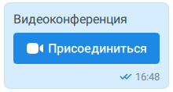
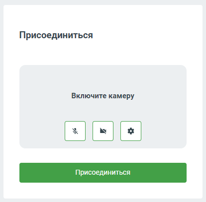

# 7.4. Как позвонить с видео абоненту или в групповой чат

> Трассировка: PDF §7.4 · сквозные стр. 58-60 · источники: ч.1 `kb/sources/mtalker/mTalker_User_Guide_ch1_Working.pdf` с.58-60.

Вы можете позвонить с видео тому или иному сотруднику непосредственно из чата MTalker. Чтобы выполнить видеозвонок, в окне MTalker следует:

1. перейдите в раздел “Чаты” и нажмите на строку с данными чата с нужным вам абонентом нужным вам групповым чатом;

2. в заголовке чата нажмите на кнопку ; 3. в истории чата появится сообщение “Видеоконференция” и кнопка “Присоединиться”. Нажмите на кнопку “Присоединиться”:

Mango Talker для сред ОС Windows и Mac. Руководство пользователя | Версия от 23.08.2024 Будет выполнено одно из действий: • если включена настройка “Открывать видеозвонки во внешнем браузере” в разделе “Видео” вашего MTalker, то будет открыта новая страница браузера, на которой отображена веб-версия MTalker, в которой вам будет предложено авторизоваться в MTalker или войти как гость в видеоконференцию. Выполните одно из действий: – если вы хотите войти в видеоконференцию как сотрудник, то: 1. нажмите кнопку “Авторизоваться”; 2. войдите в ваш аккаунт MTalker при помощи логина и пароля или с помощью короткого кода; 3. в поле “Включите камеру” перед тем, как присоединиться к

видеоконференции, вы можете включить микрофон,

включить камеру, установить настройки вашего участия в видеоконференции (например, размытие вашего фона; 4. затем в окне “Присоединиться” нажмите кнопку “Присоединиться”. После этого, вы присоединитесь к видеозвонку; – если вы хотите войти в видеоконференцию как гость (без авторизации), то: 1. нажмите кнопку “Войти как гость”; 2. укажите ваше имя в поле “Ваше имя”; 3. в поле “Включите камеру” перед тем, как присоединиться к

видеоконференции, вы можете включить микрофон,

включить камеру, установить настройки вашего участия в видеоконференции (например, размытие вашего фона). 4. затем в окне “Присоединиться” нажмите кнопку “Присоединиться”. После этого, вы присоединитесь к видеозвонку;

Mango Talker для сред ОС Windows и Mac. Руководство пользователя | Версия от 23.08.2024 • если выключена настройка “Открывать видеозвонки во внешнем браузере” в разделе “Видео” вашего MTalker, то: – в окне MTalker будет открыто окно “Присоединиться”, в котором, перед тем, как присоединиться к видеоконференции, вы можете

<!-- изображение на стр. 60: байты не извлечены (PyMuPDF недоступен) -->

<!-- изображение на стр. 60: байты не извлечены (PyMuPDF недоступен) -->

включить микрофон, включить камеру, установить настройки вашего участия в видеоконференции (например, размытие вашего фона); – в окне “Присоединиться” нажмите кнопку “Присоединиться”. После этого, вы присоединитесь к видеозвонку.

<!-- изображение на стр. 60: байты не извлечены (PyMuPDF недоступен) -->
