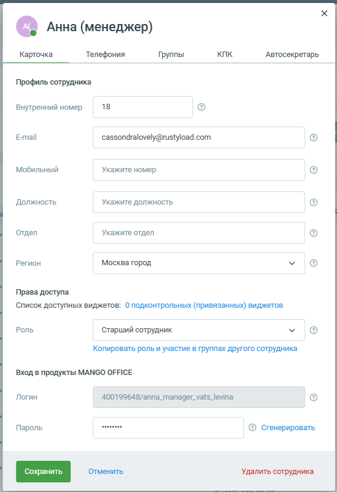

# 3.4. Вход по данным Контакт-Центра MANGO OFFICE

> Трассировка: PDF §3.4 · сквозные стр. 26-27 · источники: ч.1 `kb/sources/mtalker/UserGuide_Windows_mTalker_ch1_Working.11.06.26.pdf` с.26-27.

Кроме логина и пароля, для входа в MTalker вы можете использовать учетную запись Контакт- центра MANGO OFFICE. Данные учетной записи указываются в карточке сотрудника в Личном кабинете: Mango Talker для сред ОС Windows и Mac. Руководство пользователя | Версия от 11.06.2026

