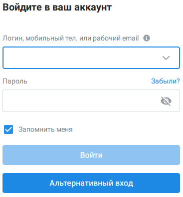
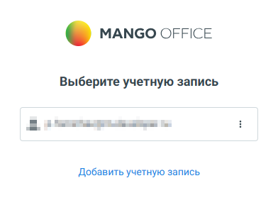

# 3.5. Вход через браузер

> Трассировка: PDF §3.5 · сквозные стр. 27-29 · источники: ч.1 `kb/sources/mtalker/UserGuide_Windows_mTalker_ch1_Working.11.06.26.pdf` с.27-29.

Вы можете войти в MTalker через браузер с использованием альтернативного способа авторизации. В этом случае вход выполняется на странице авторизации, которая открывается в системном браузере вашего компьютера. Чтобы войти через браузер, в окне входа в MTalker необходимо нажать кнопку «Альтернативный вход».

В открывшемся окне «Добро пожаловать в Mango Talker» выбрать способ входа: «С паролем» или «С кодом». После успешной авторизации данные учетной записи могут быть сохранены в браузере. В этом случае при последующих входах пользователю не потребуется повторно вводить логин и пароль — достаточно выбрать сохраненную учетную запись. Mango Talker для сред ОС Windows и Mac. Руководство пользователя | Версия от 11.06.2026

Если сохраненные учетные записи отсутствуют, в поле «Логин, почта или телефон» введите номер мобильного телефона либо адрес электронной почты.

Mango Talker для сред ОС Windows и Mac. Руководство пользователя | Версия от 11.06.2026 Выполнить один из следующих действий:  Если выбран способ «С паролем», ввести пароль в поле «Пароль» и нажать кнопку «Войти»;  Если выбран способ «С кодом», получить короткий код и ввести его в соответствующее поле. После успешной проверки данных будет выполнен вход в MTalker.
