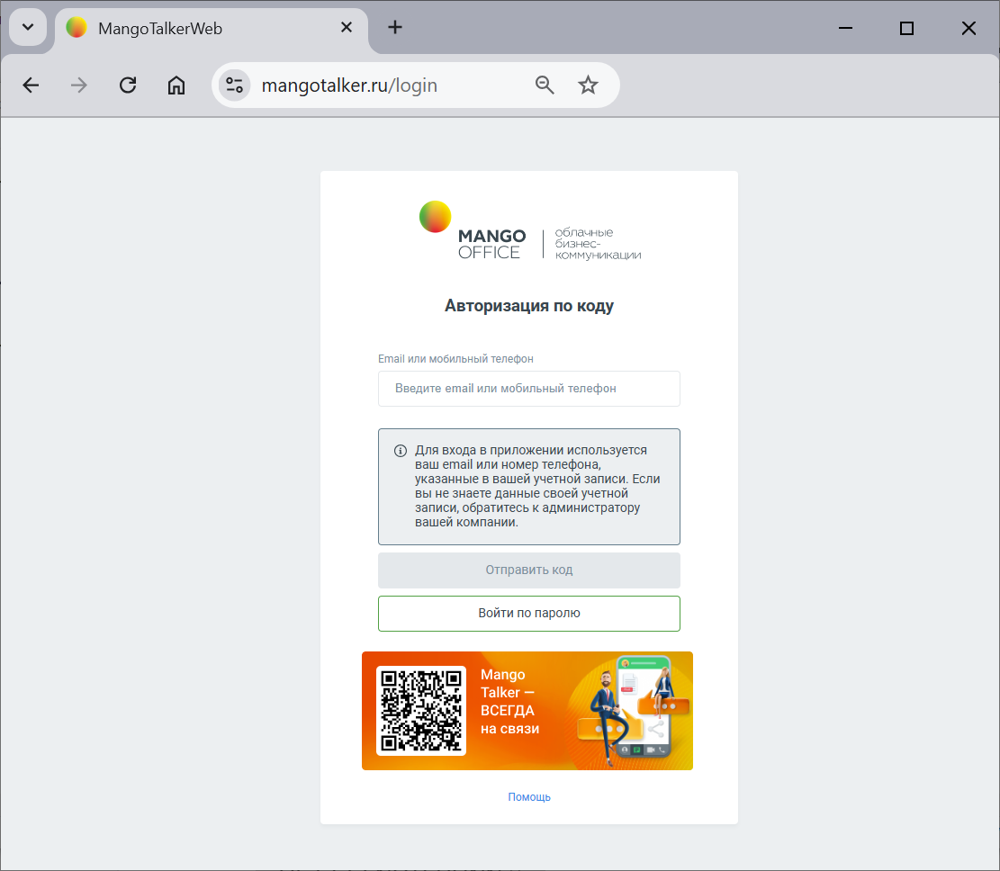

# 16.2. Как начать видеоконференцию

> Трассировка: PDF §16.2 · сквозные стр. 95-97 · источники: ч.1 `kb/sources/mtalker/mTalker_User_Guide_ch1_Working.pdf` с.95-97.

1. откройте веб-версию MTalker https://mangotalker.ru/. Будет открыто окно “Авторизация по коду”;

Mango Talker для сред ОС Windows и Mac. Руководство пользователя | Версия от 23.08.2024 2. вам нужно войти в ваш аккаунт MTalker. Для этого, выполните одно из действий: – если вы хотите войти в MTalker по логину и паролю, то выполните следующие действия: 1) нажмите кнопку “Войти по паролю” в окне “Авторизация по коду”. Будет открыто окно “Авторизация”; 2) в поле “Email или мобильный телефон” введите логин. В качестве логина вы можете указать Ваш e-mail или номер мобильного телефона, зарегистрированные в ВАТС “MANGO OFFICE”; 3) в поле “Пароль” ввести пароль; 4) нажмите кнопку “Войти”. Будет выполнен вход в веб-версию MTalker; – если вы хотите войти в MTalker по коду без пароля, то выполните следующие действия: 1. в поле “Email или мобильный телефон” введите логин. В качестве логина вы можете указать Ваш e-mail или номер мобильного телефона, зарегистрированные в ВАТС “MANGO OFFICE”; 2. нажмите кнопку “Отправить код” в окне “Авторизация по коду”. Будет открыто окно “Авторизация по коду”; 3. ВАТС отправит вам сообщение с коротким кодом на Email или мобильный телефон, введенный вами на шаге 1; 4. введите короткий код в окне “Короткий код”. Будет выполнен вход в веб-версию MTalker; 3. после входа будет открыт интерфейс веб-версии MTalker, в которой будет открыто окно “Вставьте ссылку на встречу, чтобы присоседиться” ; 4. вы можете нажать кнопку “Создать встречу”. Будет создана новая видео конференция. При этом, в поле “Ссылка на встречу” будет показана ссылка на созданную видеоконференцию. – Вы можете скопировать ссылку на видеоконференцию и отправить ее будущим участникам. – Чтобы начать видеоконференцию в помощью этой ссылке, нажмите на кнопку Присоединиться. – Присоединиться по ссылке. Вы можете присоединиться к ранее созданной видеоконференции Mango Talker для сред ОС Windows и Mac. Руководство пользователя | Версия от 23.08.2024
