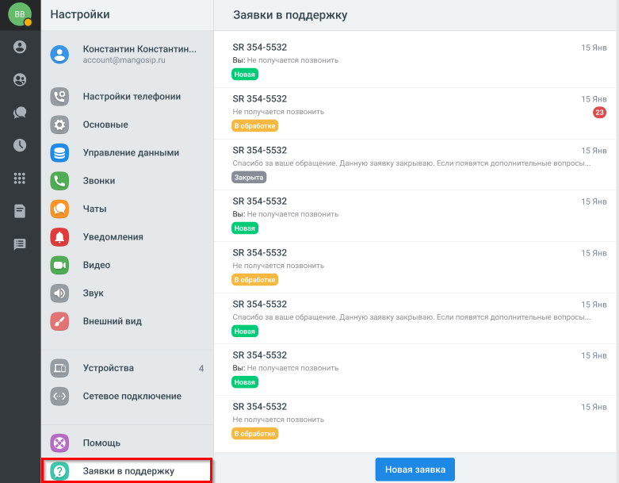
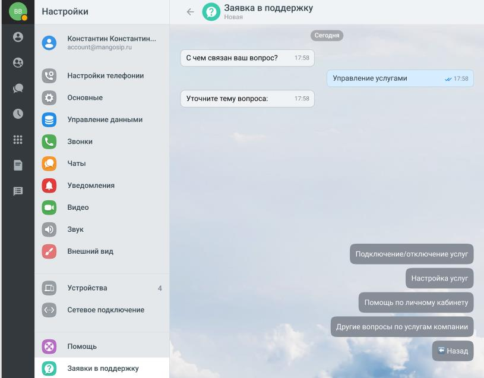
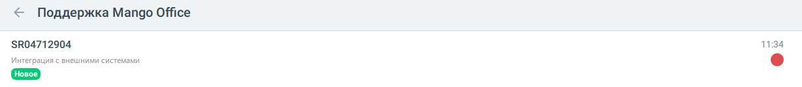
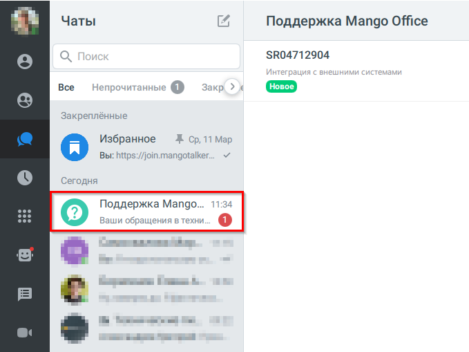

# 4.17. Работа с техподдержкой

> Трассировка: PDF §4.17 · сквозные стр. 43-48 · источники: ч.1 `kb/sources/mtalker/UserGuide_Windows_mTalker_ch1_Working.11.06.26.pdf` с.43-48.

Вы можете создавать заявки в техническую поддержку и получать ответы на них в чате. Переход в раздел техподдержки Для того чтобы открыть раздел с заявками в техподдержку, в MTalker следует: 1. перейти в раздел “Профиль”; 2. выбрать пункт “Заявки в поддержку”; 3. будет открыт список ваших заявок в техническую поддержку. Mango Talker для сред ОС Windows и Mac. Руководство пользователя | Версия от 11.06.2026

Список заявок В списке заявок отображаются:  номер заявки;  категория обращения;  статус заявки;  дата последнего обновления;  наличие новых сообщений. Если заявки отсутствуют, будет показано сообщение “Здесь появятся ваши заявки в техническую поддержку”. Mango Talker для сред ОС Windows и Mac. Руководство пользователя | Версия от 11.06.2026

Как создать заявку Для того чтобы создать заявку, в разделе “Поддержка Mango Talker” следует: 1. нажать кнопку “Новая заявка”; 2. выбрать категорию обращения; 3. выбрать тему вопроса; 4. ввести текст сообщения с описанием проблемы; 5. при необходимости прикрепить файл или изображение; 6. нажать Enter для отправки сообщения; Mango Talker для сред ОС Windows и Mac. Руководство пользователя | Версия от 11.06.2026

7. после отправки сообщения будет создана заявка в техническую поддержку с уникальным номером.

Уведомления При изменении статуса заявки или получении ответа от технической поддержки отображается уведомление. Если уведомления отключены, наличие новых сообщений отображается в списке заявок.

Чат “Поддержка Mango Talker” В разделе “Чаты” отображается чат “Поддержка Mango Talker”. Mango Talker для сред ОС Windows и Mac. Руководство пользователя | Версия от 11.06.2026 Для того чтобы открыть список заявок, в разделе “Чаты” следует: 1. найти чат “Поддержка Mango Talker”; 2. нажать на строку с названием чата. Будет открыт список созданных вами заявок.

Mango Talker для сред ОС Windows и Mac. Руководство пользователя | Версия от 11.06.2026
