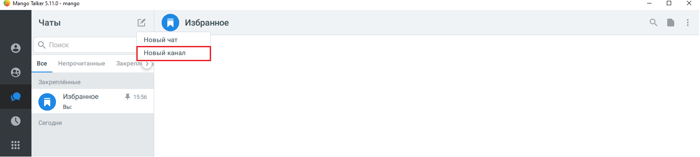
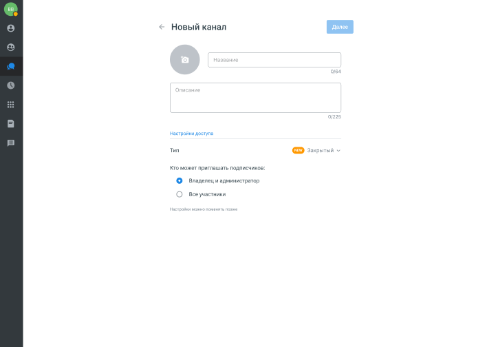
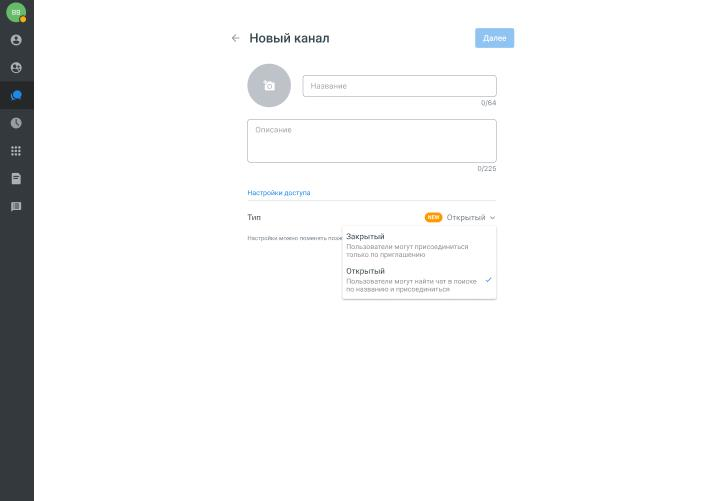
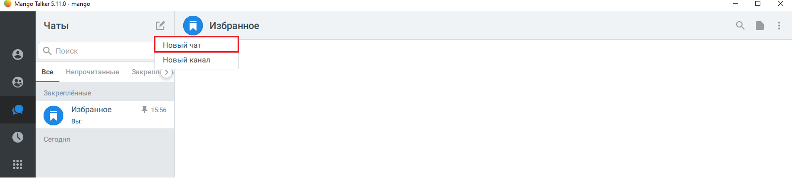
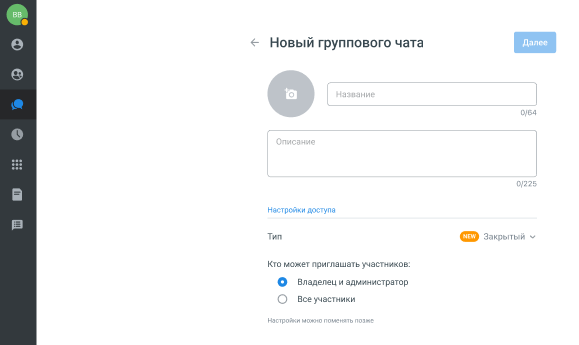
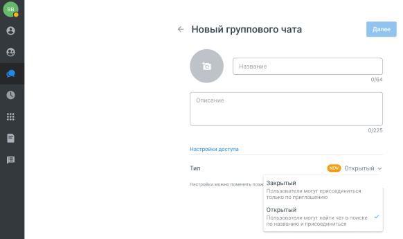
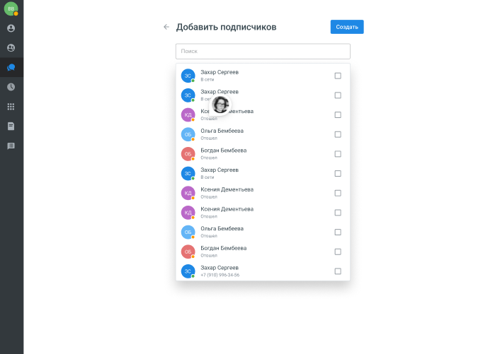
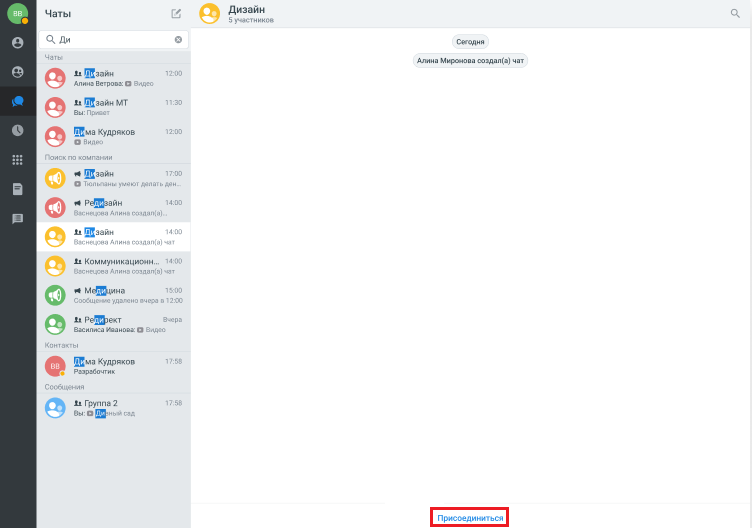

# 5.3. Публичные чаты и каналы

> Трассировка: PDF §5.3 · сквозные стр. 50-55 · источники: ч.1 `kb/sources/mtalker/UserGuide_Windows_mTalker_ch1_Working.11.06.26.pdf` с.50-55.

В MTalker можно создавать публичные чаты и каналы, которые доступны для поиска сотрудникам компании. Пользователь может найти такой чат или канал через поиск и присоединиться к нему без приглашения. По умолчанию чаты и каналы создаются как закрытые. При создании администратор может изменить тип доступа и сделать чат или канал открытым (публичным). Mango Talker для сред ОС Windows и Mac. Руководство пользователя | Версия от 11.06.2026 Как создать публичный канал

1. Откройте раздел “Чаты”. Нажмите кнопку “Новый канал”.

2. Введите название канала и описание.

Mango Talker для сред ОС Windows и Mac. Руководство пользователя | Версия от 11.06.2026 3. В разделе “Тип” выберите параметр “Открытый”.

4. Добавьте подписчиков из списка и нажмите кнопку “Создать”.

Mango Talker для сред ОС Windows и Mac. Руководство пользователя | Версия от 11.06.2026 Как создать публичный групповой чат

1. Откройте раздел “Чаты”. Нажмите кнопку “Новый чат”.

2. Укажите название чата и при необходимости добавьте описание.

Mango Talker для сред ОС Windows и Mac. Руководство пользователя | Версия от 11.06.2026 3. В разделе «Тип» выберите параметр “Открытый”.

4. Добавьте подписчиков из списка и нажмите кнопку “Создать”.

Mango Talker для сред ОС Windows и Mac. Руководство пользователя | Версия от 11.06.2026 Как найти публичный чат или канал Публичные чаты и каналы отображаются в результатах поиска MTalker. Чтобы найти публичный чат или канал:

1. Откройте раздел “Чат”. 2. В поле «Поиск» введите название чата или канала. 3. В результатах поиска выберите нужный чат или канал. 4. После открытия карточки чата или канала нажмите кнопку «Подписаться».

