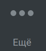

# 6.4. Как добавить третьего участника в звонок

> Трассировка: PDF §6.4 · сквозные стр. 63-64 · источники: ч.1 `kb/sources/mtalker/UserGuide_Windows_mTalker_ch1_Working.11.06.26.pdf` с.63-64.

Вы можете во время сеанса аудио связи добавить еще одного участника, тем самым начав аудио конференцию или групповой аудио звонок. В результате будет проведен общий сеанс связи, в котором участники получат возможность слышать друг друга. Для того чтобы добавить участника, в окне проведения сеанса связи следует:

1) нажать на кнопку “Еще” . Будет открыто контекстное меню; 2) выбрать пункт “Добавить участников в разговор”. Будет открыто окно “Добавить участников”; 3) кликнуть по строке с именем того участника, которого нужно добавить в сеанс. Таким образом, выбрать всех участников, которых нужно добавить в звонок; 4) нажать на кнопку “Добавить”. Будет совершен вызов добавляемых участников. После того как новые участники примут входящий вызов, они будут автоматически добавлены в текущий сеанс связи. Mango Talker для сред ОС Windows и Mac. Руководство пользователя | Версия от 11.06.2026
