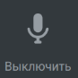

# 6.10. Как выключить микрофон

> Трассировка: PDF §6.10 · сквозные стр. 66 · источники: ч.1 `kb/sources/mtalker/UserGuide_Windows_mTalker_ch1_Working.11.06.26.pdf` с.66.

Для того чтобы отключить микрофон во время разговора, в окне проведения сеанса связи

нажмите кнопку . Будет выключен ваш микрофон и ваши собеседники вас не услышат.
