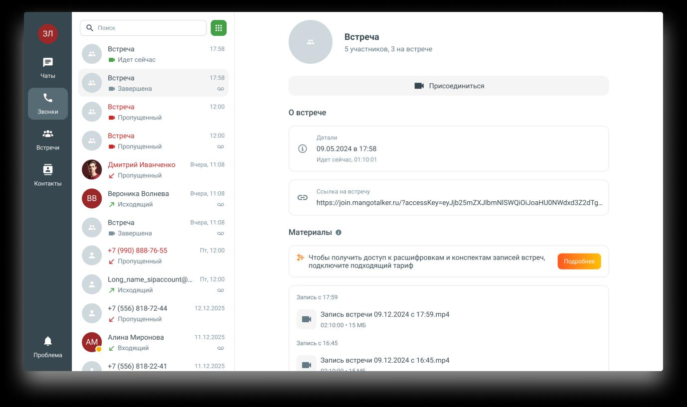
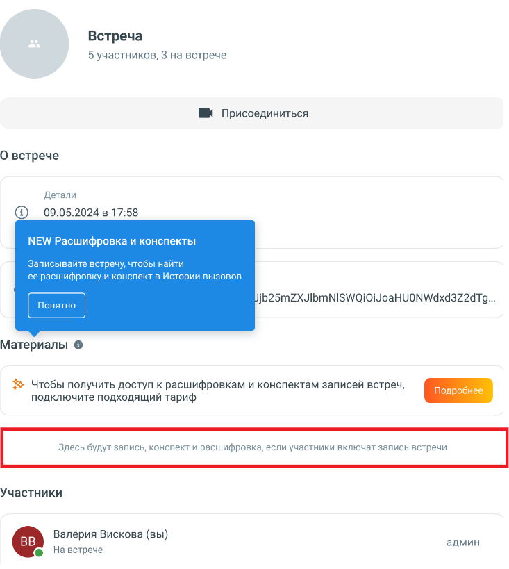
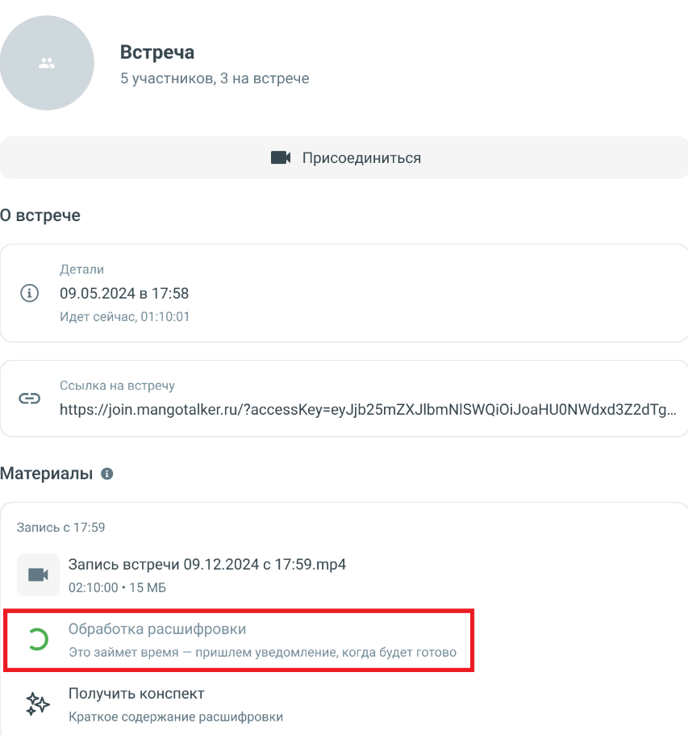
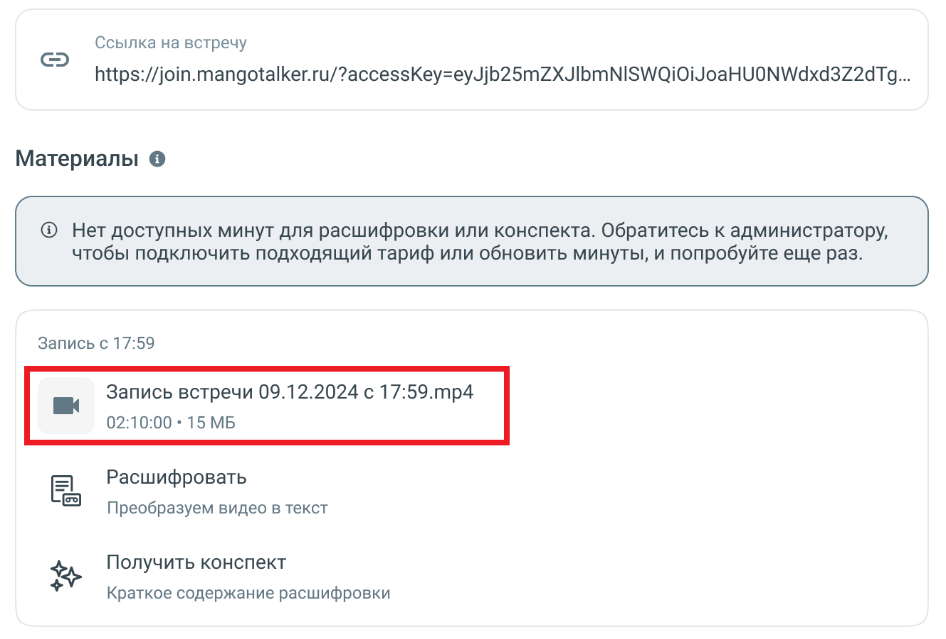
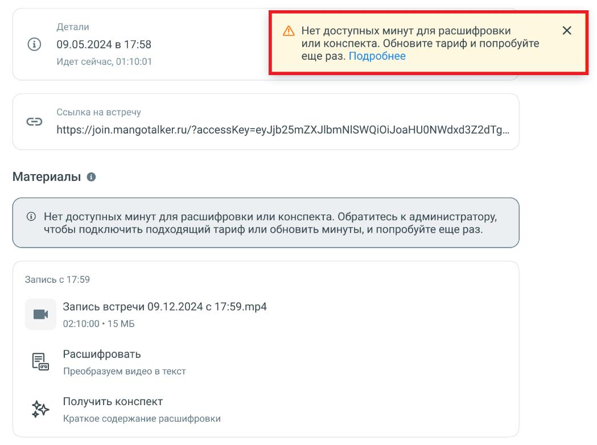

# 7.3. Расшифровка и конспектирование записей встреч

> Трассировка: PDF §7.3 · сквозные стр. 71-74 · источники: ч.1 `kb/sources/mtalker/UserGuide_Windows_mTalker_ch1_Working.11.06.26.pdf` с.71-74.

Общие сведения Расшифровка позволяет преобразовать запись видеоконференции в текстовый формат. Конспектирование позволяет получить краткое содержание записи видеоконференции на основе расшифровки. Функции расшифровки и конспектирования доступны пользователям, у которых подключена услуга Групповая “видеоконференция” и имеются доступные минуты для обработки записей. При первом открытии карточки встречи пользователю отображается информационная подсказка с описанием возможностей расшифровки и конспектирования. Запись видеоконференции становится доступна после завершения встречи. Расшифровка и конспектирование становятся доступны только после завершения обработки записи. Во время обработки в разделе “Материалы” отображается соответствующий статус выполнения операции. Если услуга не подключена Если услуга «Групповая видеоконференция» не подключена, в разделе «Материалы» отображается информационный блок с предложением подключить подходящий тариф. Для получения дополнительной информации нажмите кнопку “Подробнее”.

Mango Talker для сред ОС Windows и Mac. Руководство пользователя | Версия от 11.06.2026 Если запись видеоконференции отсутствует, в разделе “Материалы” отображается сообщение: “Здесь будут запись, конспект и расшифровка, если участники включат запись встречи”.

Получение расшифровки Для получения расшифровки: 1. Откройте карточку встречи. 2. Перейдите в раздел “Материалы”. 3. Выберите запись видеоконференции. 4. Нажмите “Расшифровать”. После отправки записи на обработку отображается статус выполнения операции. Mango Talker для сред ОС Windows и Mac. Руководство пользователя | Версия от 11.06.2026

После завершения обработки пользователь получает уведомление о готовности результата. Получение конспекта Для получения конспекта: 1. Откройте карточку встречи. 2. Перейдите в раздел “Материалы”. 3. Выберите запись видеоконференции. 4. Нажмите “Получить конспект”. Конспект формируется автоматически на основе расшифровки записи видеоконференции. Готовые материалы встречи После завершения обработки запись видеоконференции отображается в разделе “Материалы” и доступна для скачивания. Mango Talker для сред ОС Windows и Mac. Руководство пользователя | Версия от 11.06.2026

Недостаточно минут для обработки Если лимит минут для расшифровки или конспектирования исчерпан, при попытке запуска обработки отображается сообщение: «Нет доступных минут для расшифровки или конспекта. Обратитесь к администратору, чтобы подключить подходящий тариф или обновить минуты, и попробуйте еще раз». После увеличения лимита минут обработку можно запустить повторно.

