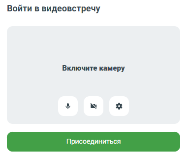
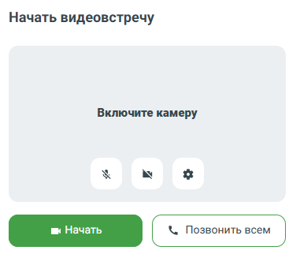

# 7.6. Как позвонить с видео абоненту или в групповой чат

> Трассировка: PDF §7.6 · сквозные стр. 75-76 · источники: ч.1 `kb/sources/mtalker/UserGuide_Windows_mTalker_ch1_Working.11.06.26.pdf` с.75-76.

Вы можете позвонить с видео сотруднику или в групповой чат из MTalker. Чтобы выполнить видеозвонок:

1. перейдите в раздел “Чаты” и нажмите на строку с данными чата с нужным вам абонентом нужным вам групповым чатом;

2. в заголовке чата нажмите на кнопку . Будет открыто окно “Присоединиться”, в котором, перед тем как присоединиться к видеоконференции, вы можете:

• включить микрофон ;

• включить камеру ; • установить настройки вашего участия в видеоконференции (например, размытие фона)

. • выполните одно из действий (в зависимости от типа чата): – если видеозвонок выполняется в чате с одним собеседником: в истории чата появится сообщение “Видеоконференция” и кнопка “Присоединиться”. Нажмите — “Присоединиться”; Mango Talker для сред ОС Windows и Mac. Руководство пользователя | Версия от 11.06.2026

– если видеозвонок выполняется в групповом чате: откроется окно видеоконференции в браузере, где необходимо выбрать способ приглашения участников: Доступные варианты: – Начать Видеоконференция создается, и вы автоматически подключаетесь к ней. В групповой чат отправляется сообщение о видеоконференции с кнопкой “Присоединиться”. Участники не получают звукового вызова. – Позвонить всем Видеоконференция создается, и вы автоматически подключаетесь к ней. Всем участникам группового чата поступает входящий видеозвонок. В чат также отправляется сообщение о видеоконференции.

