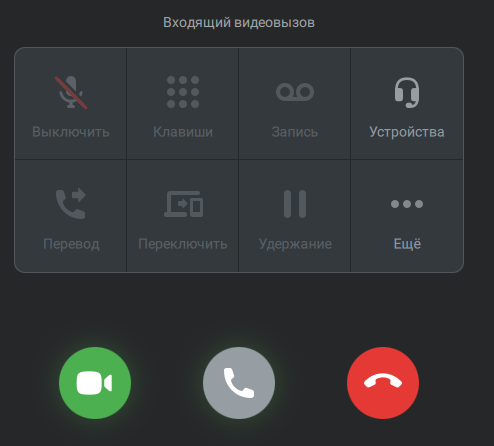

# 7.7. Как принять входящий видео звонок

> Трассировка: PDF §7.7 · сквозные стр. 76-77 · источники: ч.1 `kb/sources/mtalker/UserGuide_Windows_mTalker_ch1_Working.11.06.26.pdf` с.76-77.

Если вам позвонят по видеосвязи, то экране будет отображено всплывающее окно “Входящий видеовызов”. Примечание. Если вы долго не будете принимать видеозвонок, то в чате с абонентом, который вам звонит будет отображено сообщение “Видеоконференция” и кнопка “Присоединиться”. Mango Talker для сред ОС Windows и Mac. Руководство пользователя | Версия от 11.06.2026 Чтобы принять входящий видео звонок, нажмите кнопку .

Нажмите кнопку “Присоединиться” . После этого вы присоединитесь к видеозвонку. Во время входящего видеозвонка доступны следующие дополнительные действия: • включить/отключить микрофон; • открыть клавиатуру; • начать запись разговора; • выбрать устройства; • перевести вызов; • переключить вызов; • удержать вызов; • открыть дополнительные параметры.

