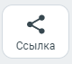
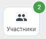
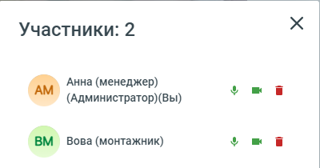
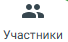

# 7.8. Как добавить или удалить сотрудников и гостей видеоконференции

> Трассировка: PDF §7.8 · сквозные стр. 77-79 · источники: ч.1 `kb/sources/mtalker/UserGuide_Windows_mTalker_ch1_Working.11.06.26.pdf` с.77-79.

Как добавить участников в видеоконференцию Для того чтобы пригласить участника в текущий видео звонок, вам нужно создать ссылку на этот видео звонок и передать ее тому, кого вы приглашаете, например, через чат MTalker. Примечание. Добавить участника в видеоконференцию может любой участник участника в видеоконференцию, а не только администратор. Чтобы создать ссылку на текущую видеоконференцию, в окне проведения видеоконференцию следует:

1. нажать на кнопку “Ссылка” . Будет скопирована ссылка на проводимый видео звонок; 2. отправьте скопированную ссылку нужному вам сотруднику или гостю. Для этого воспользуйтесь функцией “Чат” MTalker или отправьте по электронной почте или иным способом. Mango Talker для сред ОС Windows и Mac. Руководство пользователя | Версия от 11.06.2026 Получив ссылку, сотрудник или гость сможет присоединиться к вашему звонку. Он сможет видеть и слышать всех участников мероприятия, транслировать видео экрана своего ПК / окна программы, открытой на ПК . Таким образом, вы можете пригласить в видео звонок всех нужных вам участников. Как удалить участника из видеоконференции или выключить его камеру или микрофон Важно. Удаление участника или выключение его камеры или микрофона доступно только администратору видеоконференции. Чтобы удалить участника из видеоконференции или выключить его камеру или микрофон, в окне проведения видеоконференции следует:

1. нажмите кнопку “Участники” . Будет открыто окно “Участники”;

2. в окне “Участники” перечислены все участники видеоконференции и иконки управления. Нажмите на иконку, чтобы выполнить нужное вам действие:

– нажмите на “Микрофон”, чтобы выключить микрофон участника;

– нажмите на “Камера”, чтобы выключить камеру участника;

– нажмите на “Корзина”, чтобы удалить участника. Как пригласить участника звонком во время видеоконференции Во время видеоконференции вы можете пригласить участника с помощью звонка. Чтобы выполнить звонок участнику:

1. в окне видеоконференции нажмите кнопку “Участники” ; 2. нажмите кнопку “Пригласить на встречу” 3. выберите нужного сотрудника из списка; 4. нажмите кнопку «Пригласить». Выбранному участнику будет отправлен входящий звонок видеоконференции. После принятия вызова участник автоматически присоединится к текущей видеоконференции. Mango Talker для сред ОС Windows и Mac. Руководство пользователя | Версия от 11.06.2026
