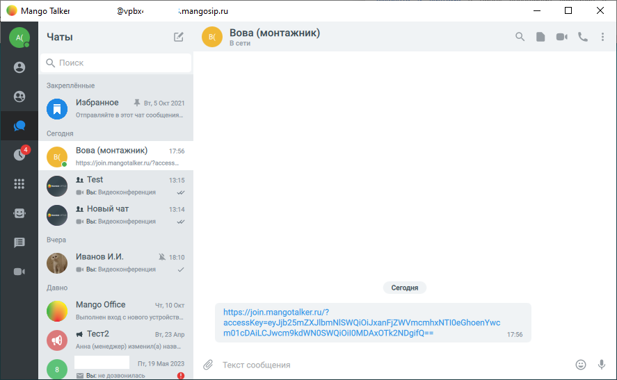
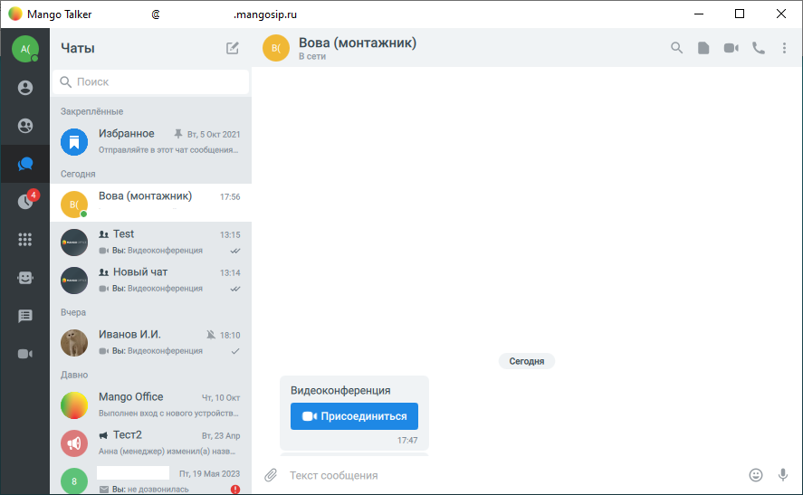

# 7.9. Как присоединиться по ссылке к видеоконференции

> Трассировка: PDF §7.9 · сквозные стр. 79-81 · источники: ч.1 `kb/sources/mtalker/UserGuide_Windows_mTalker_ch1_Working.11.06.26.pdf` с.79-81.

Важная информация Когда вас приглашают на видеоконференцию, вам отправляют ссылку на нее через чат MTalker или иным способом, например через email. При этом, в чате MTalker ссылка на видеоконференцию может выглядеть: • как обычная http-ссылка (если сообщение отправлено вручную):

• или как автоматически созданное сообщение “Видеоконференция” с кнопкой “Присоединиться”:

Mango Talker для сред ОС Windows и Mac. Руководство пользователя | Версия от 11.06.2026 Примечание. Ссылка на видеоконференцию работает одинаково для обоих вариантов отображения ссылки в чате MTalker. Чтобы присоединиться к видеоконференции по ссылке, следует: 1. нажать на ссылку на видеоконференцию или кнопку “Присоединиться”; 2. будет открыто окно “Присоединиться”, в котором перед подключением к видеоконференции вы можете:

• включить или выключить микрофон ;

• включить или выключить камеру ; • установить настройки вашего участия в видеоконференции (например, размытие фона)

. 3. нажать кнопку “Присоединиться”.

Mango Talker для сред ОС Windows и Mac. Руководство пользователя | Версия от 11.06.2026
