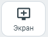

# 7.13. Включение демонстрации экрана

> Трассировка: PDF §7.13 · сквозные стр. 83 · источники: ч.1 `kb/sources/mtalker/UserGuide_Windows_mTalker_ch1_Working.11.06.26.pdf` с.83.

Как включить или выключить Во время участия в видеозвонке вы можете транслировать видео вашего экрана / программы, открытой на вашем ПК. Для того чтобы запустить демонстрацию экрана, в окне проведения видео звонка нажмите кнопку

с изображением монитора (подсвечена серым цветом) . Будет запущена трансляция изображения на вашем мониторе. При этом, все участники, кроме вас, будут видеть в окне проведения видеоконференции, трансляцию изображения на вашем мониторе. Чтобы выключить демонстрацию экрана, нажмите кнопку изображением монитора (подсвечена

зеленым цветом) . Будет завершена трансляция изображения на вашем мониторе. Как настроить качество трансляции Вот как это сделать:

1. нажмите на кнопку “Настройки” в окне видеоконференции. Будет открыто окно “Настройки”;

2. нажмите на пункт “Демонстрация экрана” ; 3. выберите качество изображения транслируемого экрана: – Full HD (оптимальная производительность); – Максимальное (Максимальное качество изображения). 4. нажмите кнопку “Закрыть”, чтобы закрыто окно “Настройки” и вернуться к видеоконференции.
