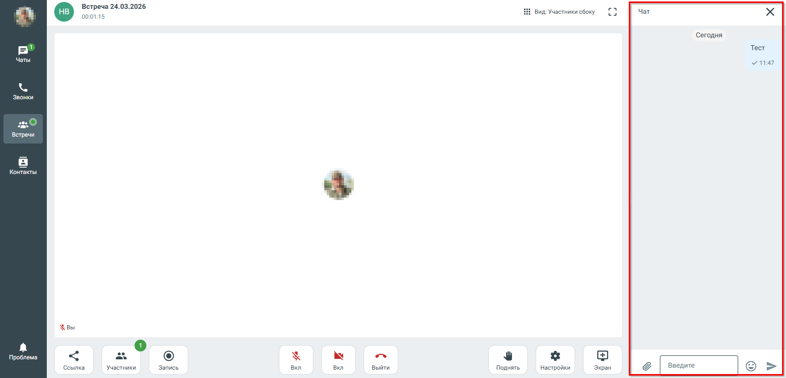
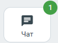

# 7.18. Чат во время видеоконференции

> Трассировка: PDF §7.18 · сквозные стр. 85-87 · источники: ч.1 `kb/sources/mtalker/UserGuide_Windows_mTalker_ch1_Working.11.06.26.pdf` с.85-87.

Во время проведения видеоконференции в MTalker доступен встроенный чат, который позволяет участникам обмениваться сообщениями в режиме реального времени. Чат доступен всем участникам видеоконференции. В окне видеоконференции перейдите в «Чат» — справа на экране будет открыто окно чата.

В чате доступны следующие возможности: • отправка текстовых сообщений; • отправка файлов, изображений и ссылок; • ответ на сообщения; • удаление отправленных сообщений. После отправки сообщение мгновенно отображается у всех участников видеоконференции. Mango Talker для сред ОС Windows и Mac. Руководство пользователя | Версия от 11.06.2026 При поступлении нового сообщения на кнопке “Чат” отображается индикатор новых

сообщений . Примечание. Чат видеоконференции является временным и не отображается в общем списке чатов MTalker. Mango Talker для сред ОС Windows и Mac. Руководство пользователя | Версия от 11.06.2026
